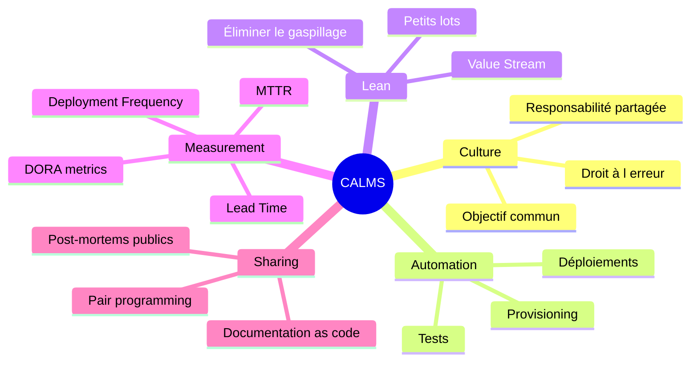
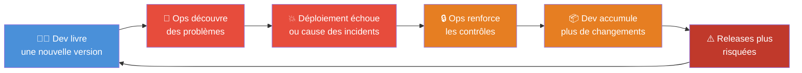
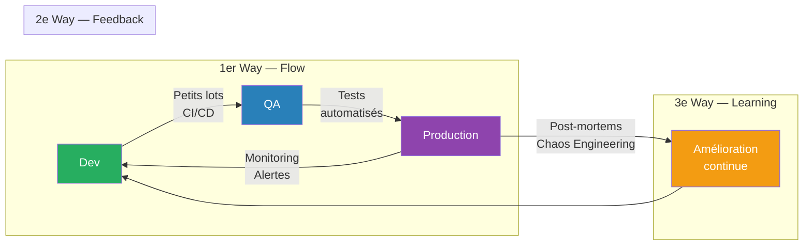
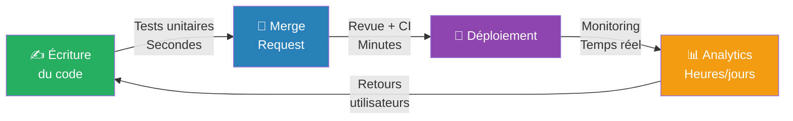
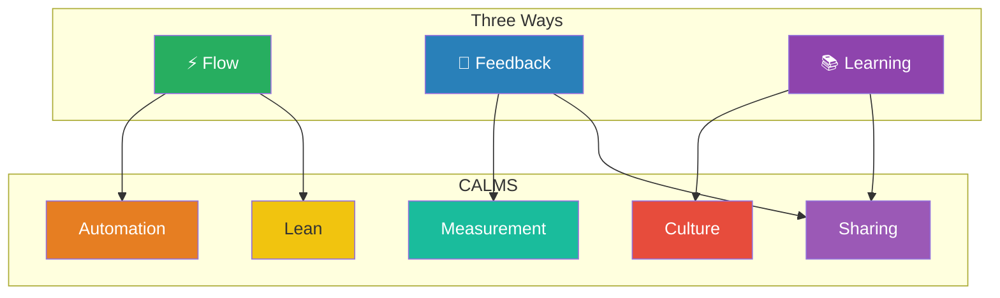

---
tags:
  - devops
  - three-ways
  - calms
  - culture
  - flow
  - feedback
  - lean
  - dora
  - gene-kim
  - amélioration-continue
---

# Three Ways et CALMS — Les fondations du DevOps

## Les deux modèles en un coup d'œil

| Approche | Auteurs | Focus | Question centrale |
|---|---|---|---|
| **Three Ways** | Gene Kim (2013) | Principes de flux | "Comment organiser le travail ?" |
| **CALMS** | Willis, Edwards, Humble (2010-2012) | Piliers culturels | "Quels sont les prérequis culturels ?" |

> **CALMS** = les fondations (culture, valeurs)
> **Three Ways** = l'architecture (processus, flux)
> Les deux sont nécessaires — l'un sans l'autre ne fonctionne pas.

---

## CALMS

### Origine
- **2010** : Willis + Edwards → CAMS
- **2012** : Jez Humble ajoute le **L** de Lean → **CALMS**

### Les 5 piliers



#### C — Culture ("Comment on travaille ensemble")

| | Avant (silos) | Après (DevOps) |
|---|---|---|
| Objectif | Chacun ses KPIs | "Livrer de la valeur au client" |
| Responsabilité | "C'est pas mon problème" | "You build it, you run it" |
| Erreurs | On cache les problèmes | On apprend des erreurs |

> ⚠️ **DevOps washing** : acheter Jenkins + Kubernetes sans changer la culture. Pipeline parfait + silos = même résultat.

#### A — Automation ("Comment gagner du temps")

| Automatiser | Ne pas automatiser (tout de suite) |
|---|---|
| Déploiements | Processus qui changent souvent |
| Tests | Processus que personne ne comprend |
| Provisioning | Cas rares et sans risque |

> Règle : plus une tâche est rare et critique, plus elle doit être automatisée — un humain oublie, un script reste fiable.

#### L — Lean ("Où perd-on du temps ?")

Les **7 gaspillages IT** (adaptés des mudas Toyota) :

| Gaspillage | Exemple |
|---|---|
| Features inutiles | Code que personne n'utilise |
| Attente | Approbation, environnement indisponible |
| Transferts | Dev → QA → Ops |
| Processus excessifs | Documentation que personne ne lit |
| Travail partiel | Features commencées, jamais finies |
| Changement de contexte | Interruptions, réunions |
| Bugs | Retravail, corrections |

#### M — Measurement ("Comment savoir si ça marche ?")

**Métriques DORA :**

| Métrique | Ce qu'elle mesure |
|---|---|
| Deployment Frequency | Fréquence de déploiement |
| Lead Time for Changes | Délai idée → production |
| Change Failure Rate | Taux d'échec des changements |
| MTTR | Temps de restauration après incident |

> Rapport DORA 2025 : abandon des 4 paliers → 7 profils combinant performance et facteurs humains.
> ⚠️ Piège : trop de métriques → personne ne les regarde. Limiter à 4-5, affichées visiblement.

#### S — Sharing ("Comment diffuser les connaissances ?")

| Fréquence | Pratique |
|---|---|
| Quotidien | Pair programming |
| Hebdomadaire | Guildes, communautés de pratique |
| Mensuel | REX, post-mortems publics |
| Continu | Documentation as code |

### Récapitulatif CALMS

| Pilier | Question clé | Anti-pattern |
|---|---|---|
| Culture | Comment travaille-t-on ensemble ? | Silos, blâme |
| Automation | Qu'est-ce qui peut être automatisé ? | Tout faire à la main |
| Lean | Où perd-on du temps ? | Gaspillages invisibles |
| Measurement | Comment sait-on si ça marche ? | Pas de métriques ou trop |
| Sharing | Comment diffuse-t-on les connaissances ? | "Seul Jean sait" |

---

## Le mur Dev/Ops et le cycle toxique



---

## Three Ways

### Origine
Gene Kim — *The Phoenix Project* (2013), *The DevOps Handbook* (2016).
Inspirés du **Lean manufacturing** (Toyota) et de la **théorie des contraintes** (Goldratt).



---

### 1er Way — Flow : faire circuler le travail

> Livrer de la valeur au client le plus vite possible, sans embouteillages.

**3 règles :**

| Règle | Pourquoi | Comment |
|---|---|---|
| Limiter le WIP | Trop de tâches en parallèle = embouteillages | Max 2-3 tickets "In Progress" par personne |
| Petits lots fréquents | Petit changement = petit risque | Commits fréquents, déploiements quotidiens |
| Automatiser | Les humains sont lents et font des erreurs | CI/CD, tests, IaC |

**Loi de Little :**
```
Lead Time = Travail en cours / Débit
```
> Pour livrer plus vite → réduire le WIP, plus facile qu'augmenter le débit.

> ⚠️ **Goulot d'étranglement** : si Dev livre 50 features/mois et QA n'en valide que 20 → recruter des devs empire les choses. Il faut d'abord débloquer la QA.

---

### 2e Way — Feedback : détecter les problèmes tôt

> Plus on détecte un problème tôt, moins il coûte cher à corriger.



> **Règle d'or** : build cassé → on arrête tout et on répare. Un build cassé bloque tout le flux.

---

### 3e Way — Learning : apprendre de ses erreurs

> Les erreurs sont des opportunités d'amélioration, pas des fautes à punir.

| Pratique | Principe |
|---|---|
| Post-mortem sans blâme | Améliorer le système, pas punir |
| Chaos Engineering | Pannes contrôlées pour découvrir les faiblesses avant un vrai incident |
| Game Days | S'entraîner aux incidents comme les pompiers |

> ⚠️ Si les gens ont peur d'être punis → ils cachent les problèmes → les mêmes erreurs se répètent.

---

## Three Ways × CALMS — La synergie



### Grille de diagnostic rapide

| Si vous observez… | Three Way impacté | Pilier CALMS défaillant |
|---|---|---|
| Déploiements longs et risqués | Flow | Automation, Lean |
| Bugs découverts en production | Feedback | Measurement, Automation |
| Mêmes incidents qui se répètent | Learning | Culture, Sharing |
| Équipes qui se renvoient la balle | Flow + Feedback | Culture |
| "On n'a pas le temps de documenter" | Learning | Sharing, Lean |
| Métriques que personne ne regarde | Feedback | Measurement, Culture |

### Anti-patterns fréquents

| Anti-pattern | Problème | Solution |
|---|---|---|
| "On a automatisé, c'est bon" | Automation sans Culture | Former, accompagner |
| "On fait des post-mortems" | Learning sans Sharing | Publier les post-mortems |
| "On a des dashboards" | Measurement sans Flow | Lier métriques → actions |
| "On collabore bien" | Culture sans Automation | Automatiser les tâches manuelles |

### La règle des 3 questions

1. **Quel Three Way est bloqué ?** (Flow, Feedback ou Learning)
2. **Quel pilier CALMS manque ?** (C, A, L, M ou S)
3. **Quelle est la plus petite action qui aurait le plus grand impact ?**
