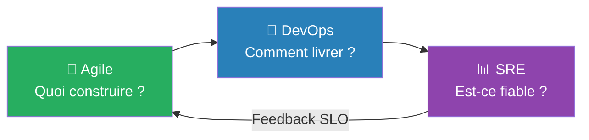
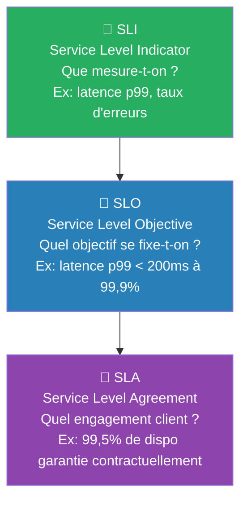
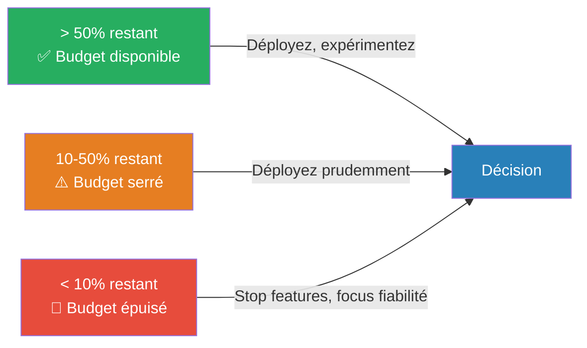
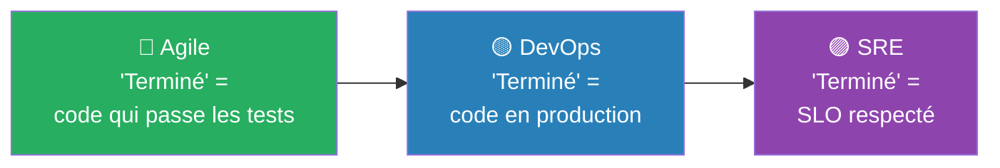
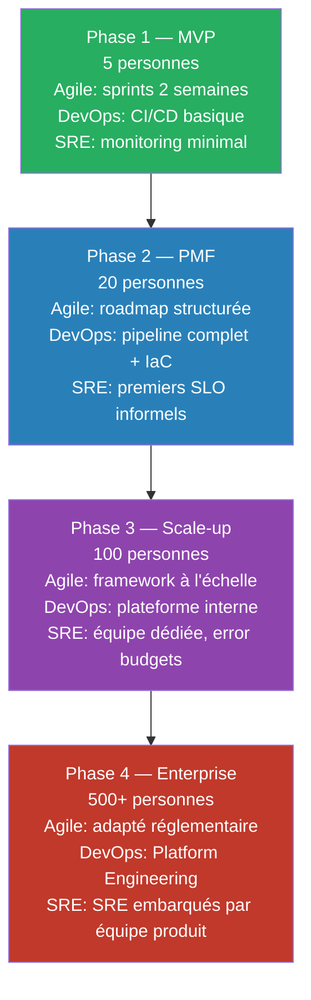

---
tags:
  - devops
  - agile
  - sre
  - fiabilité
  - slo
  - sli
  - error-budget
  - platform-engineering
  - dora
  - méthodologie
---

# Agile, DevOps et SRE — Trois approches complémentaires

> **Règle d'or :**
> - **Agile** → savoir *quoi* construire
> - **DevOps** → savoir *comment* livrer
> - **SRE** → savoir *si c'est fiable*

---

## Chronologie — d'où viennent-elles ?

| Année | Événement | Problème résolu |
|---|---|---|
| **2001** | Manifeste Agile | Projets en retard, specs décalées des besoins |
| **2003** | SRE chez Google (Ben Treynor Sloss) | Systèmes à grande échelle qui tombent trop souvent |
| **2009** | 1er DevOpsDays | Mur entre Dev et Ops qui bloque les livraisons |

> Chaque approche est née d'un problème concret — elles se complètent naturellement car elles n'ont jamais visé le même périmètre.

---

## Agile — Construire ce que le client veut

> Livrer fréquemment de petits incréments pour s'adapter aux vrais besoins.

### Les 4 valeurs du Manifeste Agile

| Valeur | Avant (cycle en V) | Après (Agile) |
|---|---|---|
| Individus et interactions | Process rigide | Équipe qui communique |
| Logiciel opérationnel | Spécifications sur papier | Code qui tourne |
| Collaboration client | Contrat figé | Feedback continu |
| Adaptation au changement | Plan suivi à la lettre | Plan qui évolue |

### ✅ Ce que l'Agile fait bien
- Cycles courts (sprints 2-4 semaines)
- Feedback utilisateur régulier
- Équipes autonomes
- Adaptation rapide aux priorités

### ❌ Ce que l'Agile ne couvre pas
- Comment déployer en production ?
- Comment gérer l'infrastructure ?
- Que faire quand le système tombe ?
- Comment coordonner Dev et Ops ?

---

## DevOps — Livrer en production sans friction

> Casser le mur entre Dev et Ops pour livrer de la valeur en continu.

### DevOps étend l'Agile

| Aspect | Agile seul | Agile + DevOps |
|---|---|---|
| Fin du sprint | "Code terminé" | "Code en production" |
| Déploiement | Événement rare et risqué | Plusieurs fois par jour |
| Incident | "Problème des Ops" | "On résout ensemble" |
| Feedback | Après la démo | Métriques temps réel |
| Responsabilité | Dev → Product Owner | Dev + Ops → client final |

### ✅ Ce que DevOps fait bien
- Collaboration Dev/Ops renforcée
- CI/CD automatisé
- Infrastructure as Code
- Monitoring et observabilité

### ❌ Ce que DevOps ne prescrit pas
- Comment définir "fiable" ?
- Quel niveau de dispo viser ?
- Comment arbitrer vitesse vs stabilité ?

---

## SRE — Garantir la fiabilité

> Définir la fiabilité avec des chiffres et gérer un "budget d'erreurs" pour équilibrer vitesse et stabilité.

> *"SRE is what happens when you ask a software engineer to design an operations function."*
> — Ben Treynor Sloss, Google (2003)

### SLI / SLO / SLA — La pyramide de la fiabilité

> ⚠️ Le SLO est toujours **plus ambitieux** que le SLA — la marge entre les deux est votre filet de sécurité avant de violer le contrat client.

### Error Budget — L'arbitre entre Dev et Ops

> Fini les débats "on déploie ou pas ?" — le chiffre décide.

### Toil — Le travail à éliminer

| Toil (à éliminer) | Travail utile (à garder) |
|---|---|
| Redémarrer un serveur à la main | Concevoir un système auto-réparant |
| Copier des logs manuellement | Analyser les tendances |
| Répondre aux mêmes alertes | Créer des runbooks automatisés |

> Objectif SRE : max **50% de toil**. Au-delà, vous éteignez des feux au lieu d'améliorer le système.

### ✅ Ce que SRE fait bien
- Définition précise de la fiabilité (SLI/SLO)
- Arbitrage objectif vitesse vs stabilité (error budget)
- Réduction méthodique du toil
- Pratiques prescriptives et mesurables

### ⚠️ Ce que SRE suppose
- Grande échelle, ingénieurs software en opérations
- Équipes dédiées à la fiabilité
- Maturité organisationnelle déjà élevée

---

## Les trois approches — Vue d'ensemble

### La définition de "terminé" évolue

### Tableau de synergie

| Agile apporte | DevOps étend | SRE précise |
|---|---|---|
| Itérations courtes | Déploiements continus | Fréquence liée à l'error budget |
| Feedback utilisateur | Monitoring temps réel | SLI pour mesurer l'impact |
| Équipe autonome | Dev et Ops intégrés | Ajout du SRE pour la fiabilité |
| "Terminé = code fini" | "Terminé = en production" | "Terminé = SLO respecté" |

---

## Cas concret — Startup qui grandit

> Vous n'adoptez pas tout d'un coup — vous ajoutez des pratiques au fur et à mesure que les problèmes apparaissent.

---

## Grille de diagnostic — Quelle approche renforcer ?

| Si vous observez… | Approche | Action |
|---|---|---|
| Features qui ne correspondent pas aux besoins | Agile | Plus de feedback, démos régulières |
| Déploiements longs et risqués | DevOps | Automatiser le pipeline, réduire les lots |
| Incidents fréquents sans amélioration | DevOps (Learning) | Post-mortems, amélioration continue |
| Débats "on déploie ou pas ?" | SRE | Définir SLO et error budgets |
| Trop de temps à éteindre des feux | SRE | Réduire le toil, automatiser |
| Conflits Dev contre Ops | DevOps (Culture) | Objectifs partagés, responsabilité commune |

---

## Anti-patterns à éviter

| Anti-pattern | Problème | Solution |
|---|---|---|
| "On fait de l'Agile, pas besoin de DevOps" | Code "terminé" qui n'arrive jamais en prod | Étendre l'Agile jusqu'au déploiement |
| "On fait du DevOps, l'Agile c'est dépassé" | Déploiements fréquents de features inutiles | Garder le feedback utilisateur |
| "On veut faire du SRE comme Google" | Pratiques inadaptées à une équipe de 10 | Adopter les concepts sans la structure |
| "SRE, c'est juste Ops renommé" | Des Ops qui font du toil avec un nouveau titre | SRE = ingénierie, pas opérations manuelles |
| "Ces approches s'opposent" | Débats stériles, silos persistants | Elles répondent à des questions différentes |

---

## Ce qui change en 2026

- **DORA 2025** : abandon des 4 paliers (Elite/High/Medium/Low) → **7 profils d'équipe** combinant performance et facteurs humains (burnout, friction).
- **IA générative** : accélère l'écriture de code, mais **amplifie les faiblesses existantes** — plus d'incidents chez les équipes sans tests solides ni observabilité. L'IA révèle la maturité DevOps, elle ne la remplace pas.
- **SRE → Platform Engineering** : convergence vers des plateformes self-service (golden paths, garde-fous automatisés, observabilité par défaut) — les principes SLI/SLO/toil restent identiques, mais à l'échelle de toute l'organisation.
