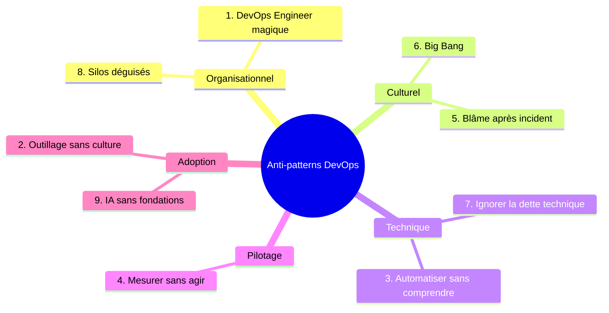
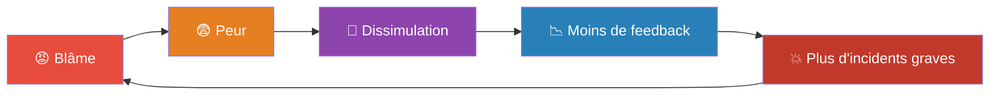
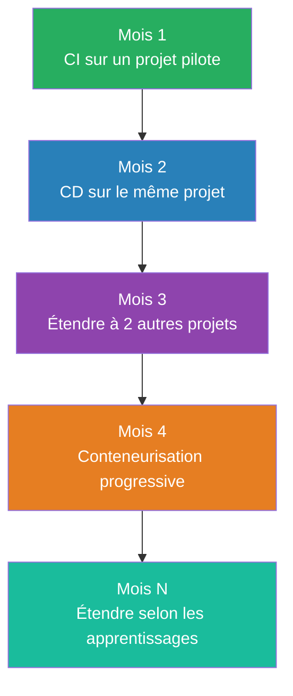
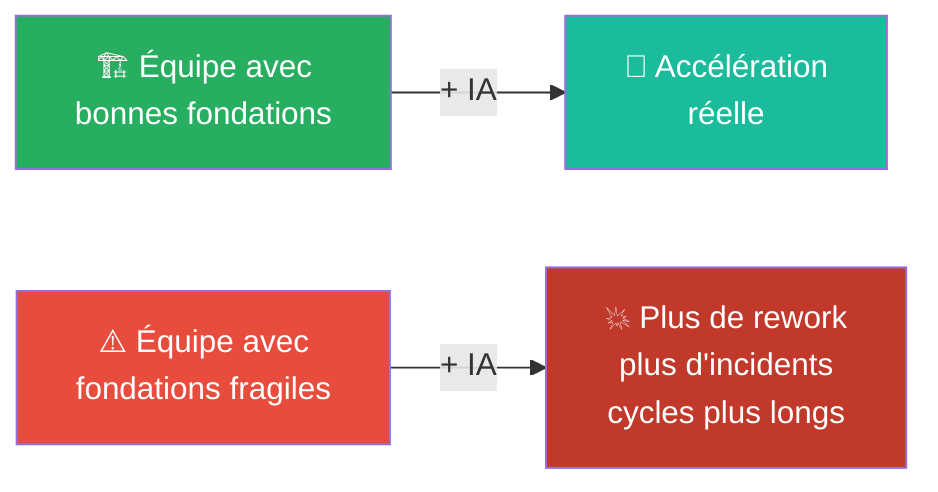

---
tags:
  - devops
  - anti-patterns
  - culture
  - dette-technique
  - post-mortem
  - ia-générative
  - platform-engineering
  - bonnes-pratiques
---

# Anti-patterns DevOps — Les pièges à éviter

> L'adoption du DevOps échoue rarement pour des raisons techniques : elle échoue quand une organisation recrute un poste plutôt qu'une culture, achète des outils avant de traiter les problèmes humains, ou automatise sans comprendre.

---

## 1. Le "DevOps Engineer" comme solution magique

> "On a besoin de DevOps. Recrutons un DevOps Engineer !"

### Pourquoi ça échoue

- Le DevOps Engineer devient un intermédiaire entre Dev et Ops
- 3 silos au lieu de 2
- Point unique de défaillance, personne surchargée

> ⚠️ **Variante 2026** : rebaptiser l'équipe DevOps en "Platform Engineering" sans rien changer aux interactions. Le Platform Engineering n'est valable que s'il construit des **parcours en libre-service** — pas une file d'attente supplémentaire.

### La solution

Intégrer les compétences DevOps dans les équipes existantes. Le rôle Platform doit :
- Former et accompagner les équipes
- Construire des outils partagés en libre-service
- Se rendre progressivement **inutile** en rendant les équipes autonomes

---

## 2. L'outillage sans la culture

> "On a acheté Kubernetes, Jenkins, Terraform et Datadog. On est DevOps maintenant !"

### Pourquoi ça échoue

| Ordre incorrect | Ordre correct |
|---|---|
| 1. Acheter des outils | 1. Identifier les problèmes culturels |
| 2. Espérer que ça change les comportements | 2. Travailler sur la collaboration |
| 3. S'étonner que rien ne change | 3. Choisir les outils qui supportent la culture |
| 4. Acheter plus d'outils | 4. Itérer et améliorer continuellement |

On peut avoir une CI/CD parfaite + Kubernetes + dashboards impressionnants **et toujours avoir** des silos, une culture du blâme, et des incidents répétés.

### La solution

**Questions à se poser avant d'acheter un outil :**
1. Quel problème humain ou culturel cet outil résout-il ?
2. Les équipes sont-elles prêtes à l'utiliser ?
3. Qui va le maintenir ?
4. Comment mesure-t-on son succès ?

---

## 3. Automatiser sans comprendre

> "Ça marche, je ne sais pas trop comment, mais ça marche."

### Pourquoi ça échoue
- Quand le pipeline casse, personne ne sait le réparer
- Accumulation de dette technique invisible — **désormais générée plus vite avec l'IA**
- Dépendance à des personnes spécifiques ou à un historique de prompts que personne ne peut rejouer

> ⚠️ **Vibe coding (2025)** : générer du code via prompt sans relecture = même failles que le code humain bâclé : configurations non validées, secrets en clair, dépendances non épinglées.

### La solution

Appliquer aux mêmes exigences à la génération IA qu'à une contribution humaine :
- Relecture avant fusion
- Commentaire expliquant l'intention
- Au moins 2 personnes capables de maintenir le résultat

> **Règle** : si vous ne pouvez pas expliquer votre pipeline à un nouveau membre en 30 minutes → il est trop complexe, qu'il ait été écrit par un humain ou généré par IA.

---

## 4. Mesurer sans agir

> "Notre lead time est de 3 semaines." — "Et qu'est-ce qu'on fait pour le réduire ?" — "... On le mesure."

### Pourquoi ça échoue
- Dashboards que personne ne regarde après la première semaine
- Métriques choisies parce qu'elles sont faciles à collecter
- Vanity metrics flatteuses mais inutiles

### La solution

Pour chaque métrique : **objectif + seuil + action + responsable**

| Métrique | Objectif | Seuil d'alerte | Action | Responsable |
|---|---|---|---|---|
| Lead time | < 1 jour | > 3 jours | Analyse des blocages | Tech Lead |
| Deployment frequency | 1/jour | < 1/semaine | Review du pipeline | Équipe |
| Change failure rate | < 15% | > 30% | Renforcer les tests | QA Lead |
| MTTR | < 1h | > 4h | Post-mortem obligatoire | SRE |

> **Règle des 3 questions** : Pourquoi on la mesure ? Quoi faire si elle se dégrade ? Qui agit ? → Si pas de réponse aux 3 : supprimer la métrique.

---

## 5. Le blâme après incident

> "Qui a fait cette erreur ?"

### Le cercle vicieux

### Pourquoi ça échoue
Dans un système complexe, une action isolée ne suffit presque jamais à provoquer une panne — il a fallu qu'aucun garde-fou ne l'arrête. Blâmer l'individu → les vrais problèmes systémiques ne sont jamais adressés.

### La solution — Post-mortem sans blâme

| Culture du blâme | Culture d'apprentissage |
|---|---|
| "Qui a fait ça ?" | "Comment le système a-t-il permis ça ?" |
| Chercher un coupable | Chercher les causes systémiques |
| Punir l'erreur | Corriger le processus |
| Cacher les problèmes | Signaler rapidement |

**Structure d'un post-mortem sans blâme :**
1. **Timeline** : que s'est-il passé ? (faits, pas jugements)
2. **Impact** : quelles ont été les conséquences ?
3. **Causes** : pourquoi c'est arrivé ? (technique, processus, communication)
4. **Actions** : comment éviter la récidive ?
5. **Suivi** : qui fait quoi, pour quand ?

---

## 6. Le DevOps "Big Bang"

> "On va tout transformer en 6 mois. Nouvelle CI/CD, Kubernetes, microservices, tout !"

### Pourquoi ça échoue
- Trop de changements simultanés = impossible d'attribuer un résultat à une cause
- Courbe d'apprentissage insurmontable
- Résistance au changement à son maximum

### La solution — Transformation incrémentale

Chaque étape doit produire un **résultat mesurable** avant de passer à la suivante.

---

## 7. Ignorer la dette technique

> "On fera du refactoring plus tard. Pour l'instant, livrons les features."

### Pourquoi ça échoue
L'effet est cumulatif : chaque raccourci renchérit tous les développements ultérieurs qui touchent la même zone. La dette ne déclenche aucune alerte — elle se paie en lenteur silencieuse.

### La solution

| Approche | Problème | Alternative |
|---|---|---|
| "Sprint de dette" | Jamais priorisé | Allouer **20% du temps** en continu |
| "On verra après" | Accumulation | Règle du Boy Scout |
| "Pas le temps" | Ralentissement progressif | Mesurer le coût de la dette |

> **Règle du Boy Scout** : "Toujours laisser le code un peu plus propre qu'on ne l'a trouvé."

---

## 8. Silos déguisés

> "On a fusionné Dev et Ops... en créant une équipe DevOps séparée."

### Pourquoi ça échoue

Le silo existe toujours — il a juste un nouveau nom. **Diagnostic** : qui ouvre un ticket à qui, et combien de temps ce ticket attend ?

**Signes d'un silo déguisé :**
- L'équipe "DevOps" reçoit des tickets des développeurs
- Les développeurs ne voient jamais la production
- "Ce n'est pas mon job" reste courant
- Les objectifs des équipes restent contradictoires

### La solution

| Silo déguisé | DevOps réel |
|---|---|
| Équipe "DevOps" séparée | Compétences intégrées dans chaque équipe |
| Tickets entre équipes | Collaboration directe |
| Responsabilités séparées | Responsabilité partagée |
| Objectifs contradictoires | Objectifs alignés sur la valeur client |

---

## 9. Attendre que l'IA compense l'absence de fondations DevOps

> "On a déployé Copilot et des agents d'IA partout. La productivité va décoller."

### Pourquoi ça échoue

**Rapport DORA 2025** (basé sur ~5 000 professionnels) : l'IA **amplifie l'existant**.

**Signaux d'alerte :**
- L'IA vue comme substitut aux problèmes culturels, pas comme amplificateur
- Aucune revue du code/config généré avant fusion
- Les équipes en difficulté reçoivent "plus d'IA" au lieu d'un accompagnement sur les fondamentaux

### La solution
Traiter l'IA comme n'importe quel autre outil — elle suit la culture, elle ne la remplace pas. Vérifier les bases avant de généraliser : VCS solide, tests fiables, petits lots, pipeline compris.

---

## Checklist d'auto-évaluation

| Question | Si oui → Warning |
|---|---|
| Avez-vous une équipe "DevOps" ou "Platform" qui reste un goulot ? | Anti-pattern 1 |
| Les outils ont-ils été choisis avant de définir les problèmes ? | Anti-pattern 2 |
| Y a-t-il du code/config que personne ne comprend ? | Anti-pattern 3 |
| Avez-vous des dashboards que personne ne regarde ? | Anti-pattern 4 |
| Cherche-t-on un coupable après les incidents ? | Anti-pattern 5 |
| Prévoyez-vous une transformation "Big Bang" ? | Anti-pattern 6 |
| La dette technique est-elle ignorée ? | Anti-pattern 7 |
| Les équipes se passent-elles des tickets malgré un renommage récent ? | Anti-pattern 8 |
| Déployez-vous des assistants d'IA sans avoir traité les points ci-dessus ? | Anti-pattern 9 |

**Score :**
- **0-2** ✅ Bonne voie
- **3-6** ⚠️ Attention requise
- **7-9** 🚨 Transformation à revoir
