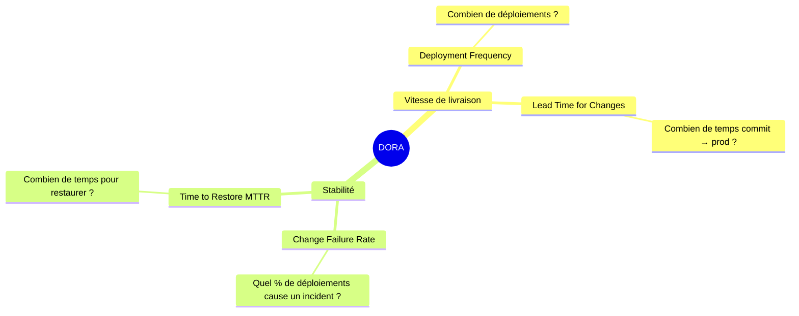
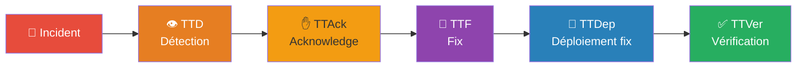
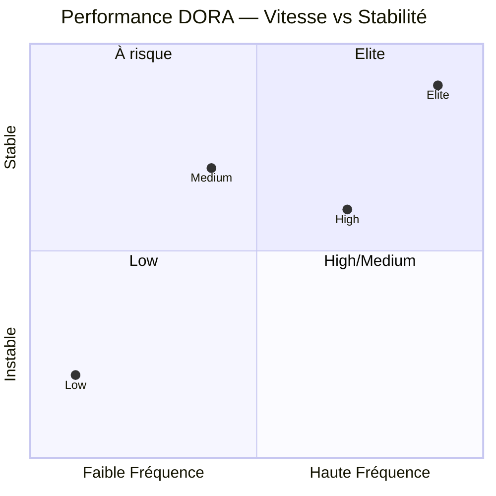
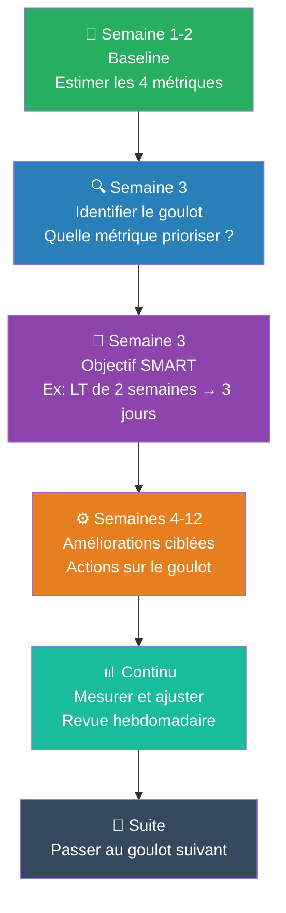

---
tags:
  - devops
  - dora
  - métriques
  - performance
  - kpi
  - cicd
  - sre
  - amélioration-continue
---

# Les métriques DORA — Mesurer la performance DevOps

> **DORA** = DevOps Research and Assessment — programme de recherche lancé en 2014 par Nicole Forsgren, Jez Humble et Gene Kim.
> Basé sur l'analyse de +39 000 professionnels dans des milliers d'organisations sur une décennie.

> ⚠️ **Ne pas confondre** avec le règlement DORA européen (Digital Operational Resilience Act) — même acronyme, sujets totalement différents.

---

## Les 4 métriques historiques

---

### 1. Deployment Frequency (DF)
> À quelle fréquence votre organisation déploie-t-elle en production ?

| Fréquence | Ce que ça indique |
|---|---|
| Multiple fois/jour | Trunk-based dev, feature flags, déploiement continu |
| 1×/jour à 1×/semaine | Bon niveau d'automatisation, quelques processus manuels |
| 1×/semaine à 1×/mois | Branches longues, tests manuels, approbations multiples |
| < 1×/mois | Silos, bureaucratie, peur du changement |

> ⚠️ Déployer fréquemment du code non testé n'est pas de la performance — analyser DF avec CFR.

---

### 2. Lead Time for Changes (LT)
> Combien de temps entre le premier commit et le déploiement en production ?

| Phase | Causes de ralentissement | Actions |
|---|---|---|
| Code Review | Équipe surchargée, PRs trop grandes | Limiter taille PRs, review en pair |
| CI/CD | Tests lents, builds séquentiels | Parallélisation, cache, tests sélectifs |
| Staging | Environnement instable, tests manuels | Tests auto, IaC |
| Deploy | Fenêtres de release, approbations | Déploiement continu, feature flags |

> 💡 Réduire le LT améliore la qualité — plus vite on détecte un problème, moins il coûte à corriger.

---

### 3. Change Failure Rate (CFR)
> Quel % de déploiements provoque un incident en production ?

**Formule :** `CFR = (Déploiements ayant causé un incident / Total déploiements) × 100`

| Inclus dans CFR | Exclus de CFR |
|---|---|
| Rollback nécessaire | Bug cosmétique sans impact |
| Hotfix déployé dans les 24h | Feature flag désactivée volontairement |
| Incident créé (P1, P2) | Problème infra non lié au code |
| Dégradation de perf > seuil | Amélioration planifiée qui révèle un bug existant |

> ⚠️ CFR à 0% pendant plusieurs mois = suspect. Peut indiquer une définition trop restrictive, des équipes qui cachent les problèmes, ou un manque de monitoring. Viser **0-15%** est réaliste.

---

### 4. Time to Restore / MTTR
> Combien de temps pour restaurer le service après un incident ?

> Note : DORA a officiellement renommé cette métrique en **Failed Deployment Recovery Time** en 2023. MTTR reste le terme le plus répandu dans les outils.

| Phase | Optimisation |
|---|---|
| TTD — Time to Detect | Monitoring synthétique, alertes proactives |
| TTAck — Acknowledge | Rotation on-call claire, escalade automatique |
| TTF — Time to Fix | Runbooks, observabilité, logs structurés |
| TTDep — Time to Deploy | Pipelines rapides, rollback automatisé |
| TTVer — Time to Verify | Tests de smoke, monitoring post-deploy |

> 💡 Les équipes Elite ne font pas moins d'erreurs — elles **récupèrent plus vite**.

---

## Niveaux de performance

| Niveau | DF | LT | CFR | MTTR |
|---|---|---|---|---|
| **Elite** | Multiple/jour | < 1 jour | ~5% | < 1 heure |
| **High** | 1/jour – 1/semaine | 1 jour – 1 semaine | ~20% | < 1 jour |
| **Medium** | 1/semaine – 1/mois | 1 semaine – 1 mois | ~10% | < 1 jour |
| **Low** | < 1/mois | > 1 mois | ~40% | 1 semaine – 1 mois |

> **Stat clé (DORA 2024)** : équipes Elite vs Low → **182× plus de déploiements**, LT **127× plus court**, CFR **8× plus bas**, MTTR **2293× plus rapide**.

> ⚠️ Depuis **DORA 2025** : abandon du modèle Elite/High/Medium/Low → **7 profils d'équipe** combinant performance de livraison et facteurs humains (burnout, friction). Le modèle à 4 niveaux reste la meilleure porte d'entrée pédagogique.

---

## Évolution du modèle DORA

| Année | Évolution |
|---|---|
| 2014 | 4 métriques historiques (DF, LT, CFR, MTTR) |
| 2018 | Ajout de l'**Availability** |
| 2021 | Availability → **Reliability** (SLO-based) |
| 2023 | MTTR → **Failed Deployment Recovery Time** |
| 2024 | Ajout du **Deployment Rework Rate** (% de déploiements = corrections non planifiées) |
| 2025 | 4 niveaux → **7 profils d'équipe** ; rapport renommé "State of AI-assisted Software Development" |

**2 familles actuelles :**
- **Throughput** : Lead Time, Deployment Frequency, Failed Deployment Recovery Time
- **Instability** : Change Fail Rate, Deployment Rework Rate

---

## Collecte des métriques

| Métrique | Sources | Données à extraire |
|---|---|---|
| DF | CI/CD (GitLab, GitHub Actions, Jenkins) | Timestamp des déploiements réussis |
| LT | VCS + CI/CD | Timestamp commit → timestamp deploy |
| CFR | CI/CD + Incident Management | Déploiements + incidents corrélés |
| MTTR | Incident Management + Monitoring | Création incident → résolution |

**Outils :**
- **DevLake** (Apache) — référence open source actuelle, multi-sources
- **GitLab DORA Metrics** (Ultimate) — intégré nativement
- **GitHub Insights** (Enterprise)
- **Sleuth** — spécialisé DORA, multi-source
- ~~Four Keys (Google)~~ — archivé début 2024, ne plus utiliser

---

## Plan d'amélioration pas à pas

### Diagnostic — Quelle métrique prioriser ?

| Symptôme | Métrique | Actions |
|---|---|---|
| "On a peur de déployer" | CFR | Tests de non-régression, canary deploys |
| "Les features mettent des mois" | LT | Limiter taille des PRs, paralléliser CI |
| "Déployer est toujours un événement" | DF | Automatiser tests, réduire approbations |
| "Les incidents durent des jours" | MTTR | Runbooks, améliorer monitoring |

---

## Pièges à éviter

| Piège | Symptôme | Solution |
|---|---|---|
| **Gamification** | Équipes qui "trichent" | Mesurer pour apprendre, pas pour punir — jamais de bonus liés aux métriques |
| **Moyenne vs Médiane** | Un outlier fausse tout | Utiliser médiane et percentiles (P90, P95) |
| **Silos de mesure** | Chaque équipe mesure différemment | Glossaire commun |
| **Hors contexte** | Comparer startup et banque | Se benchmarker par rapport à soi-même d'abord |
| **Tout mesurer** | Paralysie analytique | Commencer avec une approximation, raffiner ensuite |
| **Ignorer les outliers** | Incidents majeurs exclus des stats | Analyser séparément, ne jamais ignorer |

> 🚨 **Anti-pattern le plus dangereux** : utiliser DORA pour **comparer des équipes entre elles** ou pour des évaluations individuelles → manipulation des chiffres + destruction de la culture de transparence.
