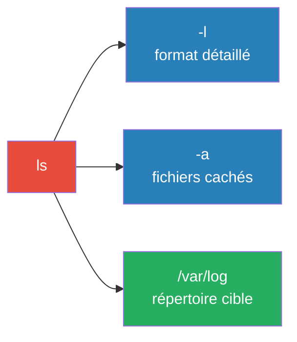
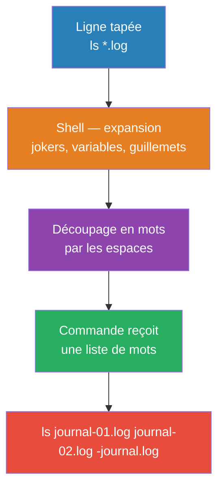

---
tags:
  - linux
  - commandes
  - cli
  - bash
  - shell
  - fondamentaux
  - sysadmin
---

# Anatomie d'une commande Linux

> Comprendre la structure `commande [options] [arguments]`, c'est pouvoir lire toutes les commandes que vous rencontrerez — sans les apprendre par cœur.

---

## Structure de base

```
commande [options] [arguments]
    │         │          │
    │         │          └─ Ce sur quoi la commande agit
    │         └─ Modifient le comportement
    └─ Le programme à exécuter
```

**Exemple :** `ls -la /var/log`



---

## Options — courtes et longues

| Format | Syntaxe | Exemple | Usage |
|---|---|---|---|
| **Courte** | `-` + une lettre | `ls -l` | Quotidien, rapide |
| **Longue** | `--` + un mot | `ls --all` | Scripts, plus lisible |

### Combiner des options courtes

```bash
# Ces trois lignes sont identiques
ls -l -a -h
ls -la -h
ls -lah
```

> ⚠️ L'ordre des options entre elles est sans importance — la commande les traite toutes avant d'agir. L'ordre des **arguments** compte presque toujours.

### Options avec valeur — 4 écritures équivalentes

```bash
head -n 2 fichier.log      # court, valeur séparée
head -n2 fichier.log       # court, valeur collée
head --lines=2 fichier.log # long, avec =
head --lines 2 fichier.log # long, valeur séparée
```

> ⚠️ Une option à valeur **consomme le mot suivant**, quel qu'il soit. Dans un groupe d'options courtes, l'option à valeur doit être la **dernière** :
> - `head -vn2 fichier.log` ✅ (v puis n avec valeur 2)
> - `head -n2v fichier.log` ❌ (`head: invalid number of lines: '2v'`)

> ⚠️ **Aucune option n'est universelle** : `-r` = `--recursive` pour `grep`, mais `--reverse` pour `sort`. Toujours vérifier avec `--help`.

---

## Le séparateur `--` — fin des options

Un fichier dont le nom commence par un tiret est interprété comme une option. Solution : `--` signale à la commande que tout ce qui suit est un argument.

```bash
# Fichier nommé "-journal.log"
head -n1 -journal.log      # ❌ head: invalid option -- 'j'
head -n1 -- -journal.log   # ✅ fonctionne
head -n1 ./-journal.log    # ✅ fonctionne aussi
```

### Le piège silencieux de `rm -f`

```bash
touch ./-f
rm -f           # ❌ silencieux ! rm comprend -f comme l'option "force"
echo $?         # 0 — succès apparent
ls              # le fichier -f existe toujours !

rm -- -f        # ✅ supprime vraiment le fichier
```

> 🚨 `rm -f` sur un fichier nommé `-f` ne produit **aucune erreur** et retourne `0` — c'est le pire cas : un échec silencieux. Toujours utiliser `--` ou `./` pour les noms commençant par un tiret.

---

## Ce que le shell fait avant que la commande démarre

La ligne que vous tapez n'est **pas** celle que la commande reçoit — le shell la transforme d'abord.



### Jokers (glob)

```bash
echo *.log        # shell développe → journal-01.log journal-02.log
echo "*.log"      # guillemets → *.log (littéral)
echo '*.log'      # idem
```

> ⚠️ Si un joker produit un nom commençant par `-`, la commande le lira comme une option. Solution : `ls -l -- *.log`

> ⚠️ Si le joker ne correspond à rien → bash passe le motif littéral (`No such file or directory: '*.csv'`) ; zsh échoue plus tôt avec `no matches found`.

### Guillemets simples vs doubles

| | Guillemets doubles `"..."` | Guillemets simples `'...'` |
|---|---|---|
| Variables | Développées (`$HOME` → `/home/user`) | Bloquées (`$HOME` reste `$HOME`) |
| Jokers | Bloqués | Bloqués |
| Espaces | Préservés | Préservés |

```bash
echo "$HOME"    # → /home/student
echo '$HOME'    # → $HOME

# Fichier avec espace dans le nom
head -n1 mon rapport.md     # ❌ deux arguments → deux fichiers
head -n1 "mon rapport.md"   # ✅ un seul argument
```

### Déboguer avec `set -x` et `echo`

```bash
set -x              # affiche chaque commande après expansion (préfixée de +)
head -n1 *.log      # on voit ce que la commande reçoit vraiment
set +x              # désactiver

# Alternative : echo montre l'expansion sans exécuter
echo *.log
```

---

## Codes de retour

```bash
ls /etc
echo $?    # 0 → succès

ls /inexistant
echo $?    # 2 → erreur
```

| Code | Signification |
|---|---|
| **0** | Réussite |
| **1** | Erreur générale |
| **2** | Mauvaise utilisation (option invalide, argument manquant) |
| **126** | Permission refusée (fichier non exécutable) |
| **127** | Commande introuvable |

> 💡 Pas de sortie + code 0 = succès silencieux — comportement normal sous Linux.

---

## Lire un message d'erreur

Format : `commande: type d'erreur: détail`

| Message | Signification | Action |
|---|---|---|
| `command not found` | Commande absente ou mal orthographiée | Vérifier le nom, installer le paquet |
| `No such file or directory` | Chemin incorrect | Vérifier avec `ls` |
| `Permission denied` | Droits insuffisants | `sudo` si légitime |
| `Is a directory` | Dossier traité comme fichier | Ajouter `-r` ou corriger la cible |
| `invalid option -- 'x'` | Option inconnue, souvent un nom de fichier commençant par `-` | Utiliser `--` avant l'argument |
| `invalid number of lines: 'fichier'` | Option à valeur sans sa valeur | Remettre la valeur juste après l'option |

---

## Lire une ligne de synopsis

La première ligne d'un `--help` ou la section `SYNOPSIS` d'un `man` suit une notation standard :

| Notation | Sens |
|---|---|
| `MOT` en majuscules | À remplacer par votre valeur |
| `[ ]` | Facultatif |
| `...` | Répétable (0 ou plusieurs) |
| `\|` | Au choix — l'un **ou** l'autre |
| `or:` | Autre forme d'appel complète |

**Exemples :**

```
grep [OPTION]... PATTERNS [FILE]...
│    │           │         │
│    │           │         └─ fichiers : facultatifs, répétables
│    │           └─ motif : OBLIGATOIRE (sans crochets)
│    └─ options : facultatives, répétables
└─ commande
```

```
date [OPTION]... [+FORMAT]
  or: date [-u|--utc|--universal] [MMDDhhmm[[CC]YY][.ss]]
              │    │               └─ crochets imbriqués : chaque partie est facultative
              └────┘ trois écritures identiques pour la même option
```

---

## Dépannage

| Symptôme | Cause probable | Solution |
|---|---|---|
| `invalid option -- 'x'` sur commande correcte | Argument commence par `-` | Relancer avec `--` avant les arguments |
| `command not found`, code 127 | Faute de frappe ou paquet absent | Vérifier l'orthographe, puis `type <cmd>` |
| `No such file or directory` sur nom visible | Espace dans le nom ou chemin faux | Encadrer l'argument de guillemets |
| `invalid number of lines: 'fichier'` | Option à valeur sans valeur | Remettre la valeur juste après l'option |
| Commande agit sur plus de fichiers que prévu | Joker développé par le shell | Rejouer avec `echo` devant |
| `cannot open '*.ext'` | Joker sans correspondance, passé littéral | Vérifier avec `ls` que des fichiers existent |
| Commande ne fait rien, retourne 0 | Argument pris pour une option | `set -x` pour voir la ligne réelle |
