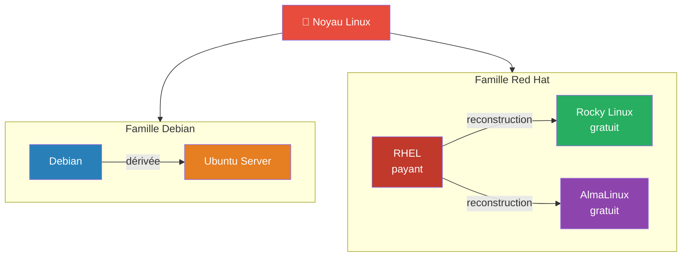
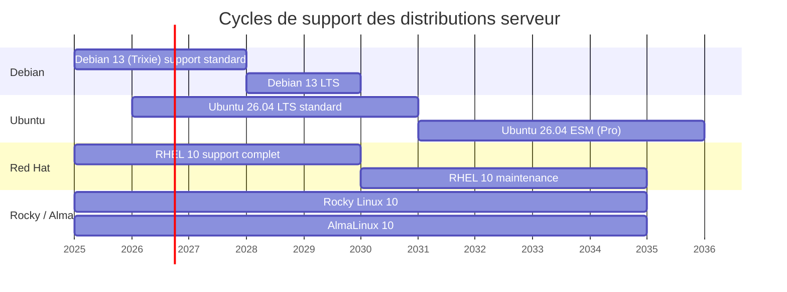

---
tags:
  - linux
  - distribution
  - serveur
  - debian
  - ubuntu
  - rhel
  - rocky-linux
  - apt
  - dnf
  - sysadmin
  - devops
---

# Choisir une distribution Linux serveur

> En production serveur, deux familles dominent le marché. Les concepts Linux sont identiques partout — seules quelques commandes d'administration diffèrent.

---

## Les deux familles serveur



| Critère | Famille Debian | Famille Red Hat |
|---|---|---|
| **Distributions** | Debian, Ubuntu Server | RHEL, Rocky Linux, AlmaLinux |
| **Gestionnaire de paquets** | `apt` (paquets `.deb`) | `dnf` (paquets `.rpm`) |
| **Cycle de support** | Debian ~5 ans, Ubuntu LTS 5 ans (+5 ESM) | RHEL 10 ans |
| **Config réseau** | Netplan (Ubuntu) / `/etc/network/interfaces` (Debian) | NetworkManager |
| **Cible principale** | Web, cloud, containers, homelab | Entreprise, RHCSA, SI critiques |
| **Coût** | Gratuit | RHEL payant (abonnement), Rocky/Alma gratuits |
| **Init** | systemd | systemd |

---

## La différence quotidienne — le gestionnaire de paquets

```bash
# Famille Debian
sudo apt update
sudo apt install nginx

# Famille Red Hat
sudo dnf install nginx
```

Même résultat, commandes et format de paquet différents.

---

## Quelle distribution choisir ?

| Objectif | Distribution recommandée | Pourquoi |
|---|---|---|
| **Apprendre Linux** | Ubuntu Server LTS ou Debian | Large communauté, documentation abondante |
| **Préparer la RHCSA** | Rocky Linux ou AlmaLinux | Compatible RHEL, l'examen se passe sur RHEL |
| **Serveur web / cloud** | Ubuntu Server LTS | Standard du cloud (AWS, GCP, Azure) |
| **Entreprise** | RHEL | Support commercial, certifications, conformité |
| **Homelab** | Debian | Légère, stable, sans cycle commercial |

> 💡 **Sans contrainte ?** Commencez par Debian ou Ubuntu Server LTS — vous passerez à Red Hat sans difficulté, les concepts sont les mêmes.

---

## Versions et cycles de support (2026)



| Distribution | Version (2026) | Fin support standard | Fin de vie réelle |
|---|---|---|---|
| **Debian** | 13 (Trixie) | août 2028 | juin 2030 (LTS) |
| **Ubuntu Server** | 26.04 LTS | avril 2031 | +5 ans ESM (Ubuntu Pro) |
| **RHEL** | 10 | mai 2030 | mai 2035 (maintenance) |
| **Rocky Linux** | 10 | — | mai 2035 |
| **AlmaLinux** | 10 | — | mai 2035 |

> ⚠️ **Éviter les versions non-LTS** : Ubuntu publie des versions intermédiaires (25.04, 25.10…) avec seulement 9 mois de support. Toujours utiliser une version LTS sur un serveur.

> ⚠️ **Ne pas démarrer un nouveau serveur sur une version proche de sa fin de support standard.**

### Nuance sécurité gratuite — Debian vs Ubuntu

| | Debian | Ubuntu |
|---|---|---|
| Paquets couverts gratuitement | Dépôt `main` (paquets serveur courants inclus) | Dépôt `main` (~2 300 paquets) |
| Paquets comme nginx, redis, fail2ban | Dans `main` → couverts | Dans `universe` → "best effort", sans engagement |

---

## Reconnaître une famille au premier coup d'œil

```bash
# Identifier la distribution et la famille
cat /etc/os-release

# Vérifier le gestionnaire de paquets disponible
which apt    # Debian/Ubuntu
which dnf    # Red Hat/Rocky/Alma
```

---

## À retenir

- **Debian** → `apt` / `.deb`
- **Red Hat** → `dnf` / `.rpm`
- Pour apprendre → Ubuntu Server LTS ou Debian
- Pour préparer la RHCSA → Rocky Linux ou AlmaLinux
- Toujours choisir une version LTS / à support long terme
- Les concepts Linux sont universels — seules quelques commandes diffèrent
