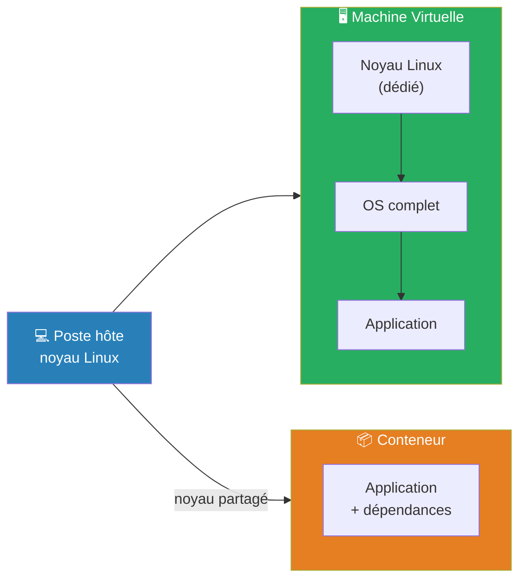
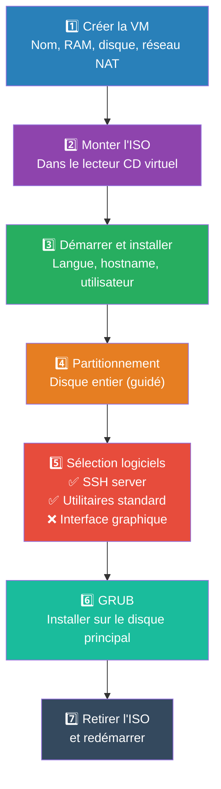

---
tags:
  - linux
  - vm
  - virtualisation
  - installation
  - kvm
  - virtualbox
  - snapshot
  - fondamentaux
  - sysadmin
---

# Installer Linux dans une machine virtuelle

> **Objectif** : obtenir un serveur Linux complet, isolé, que vous pouvez casser et recréer à volonté sans toucher à votre système principal.

---

## Les 4 façons d'avoir un Linux — comparaison

| Voie | Ce qu'on obtient | Ce qui manque pour apprendre l'administration |
|---|---|---|
| **VM locale** (VirtualBox, KVM, VMware) | Système complet avec son propre noyau | Rien — c'est le choix recommandé |
| **Conteneur** (Docker, Podman) | Application + dépendances sur le noyau de l'hôte | Le noyau n'est pas le vôtre |
| **WSL2** (Windows) | Noyau Linux compilé par Microsoft | C'est Windows qui tient les commandes de la machine |
| **Serveur distant** (hébergeur) | Machine joignable en SSH | Pas de console si vous coupez le réseau |

### VM vs Conteneur



| Question | VM | Conteneur |
|---|---|---|
| Poids | Plusieurs Go | Quelques Mo |
| Démarrage | Minutes | Secondes |
| Isolation | Forte (systèmes séparés) | Moyenne (noyau partagé) |
| Apprendre l'administration | ✅ Recommandé | Pour plus tard |

> ⚠️ Un conteneur **partage le noyau de l'hôte** — tout ce qui relève du noyau lui échappe (redémarrage, partitionnement, pare-feu au niveau système).
> Docker sur Windows ou macOS s'appuie sur une VM Linux cachée.

---

## Choisir un logiciel de virtualisation

| Logiciel | Système hôte | Niveau | Remarque |
|---|---|---|---|
| **VirtualBox** | Windows, macOS, Linux | Débutant | Gratuit, simple, multi-plateforme |
| **virt-manager (KVM)** | Linux uniquement | Intermédiaire | Performances natives, standard pro |
| **VMware Workstation Player** | Windows, Linux | Débutant | Gratuit usage personnel |
| **Hyper-V** | Windows Pro/Enterprise | Intermédiaire | Intégré à Windows |
| **UTM** | macOS Apple Silicon | Débutant | Basé sur QEMU, adapté M1/M2/M3 |

> 💡 Windows/macOS Intel → **VirtualBox** ; Linux → **virt-manager (KVM)**

---

## Vérifier la virtualisation matérielle avant de commencer

Sans **Intel VT-x** ou **AMD-V** actifs, les VM tournent en émulation pure — très lentement.

```bash
# 1. Ce que le processeur annonce
lscpu | grep -i virtu
# → Virtualization: VT-x (Intel) ou AMD-V (AMD)

# 2. Nombre de cœurs portant l'extension
grep -Ec '(vmx|svm)' /proc/cpuinfo
# → 0 = pas de support ou désactivé dans le BIOS ; > 0 = OK

# 3. Point d'entrée du noyau
ls -l /dev/kvm
# → le fichier doit exister ; groupe propriétaire = kvm

# 4. Modules chargés
lsmod | grep kvm
# → kvm_intel (Intel) ou kvm_amd (AMD)
```

> ⚠️ Si `/dev/kvm` est absent ou `grep vmx|svm` retourne 0 → activer VT-x/AMD-V dans le BIOS/UEFI.

---

## Télécharger l'image ISO

Toujours télécharger l'image **server** ou **netinstall**, jamais la version desktop.

| Distribution | URL | Image |
|---|---|---|
| Debian | debian.org/download | `debian-13.x.x-amd64-netinst.iso` (~600 Mo) |
| Ubuntu Server | ubuntu.com/download/server | `ubuntu-26.04-live-server-amd64.iso` |
| Rocky Linux | rockylinux.org/download | `Rocky-10-x86_64-minimal.iso` |

```bash
# Vérifier l'intégrité après téléchargement
sha256sum debian-13.x.x-amd64-netinst.iso
# Comparer avec l'empreinte publiée sur le site officiel
```

---

## Ressources recommandées pour une VM d'apprentissage

| Ressource | Valeur |
|---|---|
| RAM | 2 Go |
| CPU | 2 vCPU |
| Disque | 20 Go (allocation dynamique) |
| Réseau | NAT |

> Le CPU se **prête** (l'hyperviseur distribue le temps de calcul) ; la RAM se **réserve** (4 Go donnés à une VM = 4 Go retirés au poste). C'est la RAM qui limite le nombre de VM simultanées.

### Disque — allocation dynamique vs taille fixe

| Critère | Dynamique (thin) | Fixe (thick) |
|---|---|---|
| Espace consommé | Ce qui est réellement écrit | Tout, dès la création |
| Création | Rapide | Plus lente |
| Performance | Variable | Constante |
| Risque | Saturation du poste si non surveillé | Espace immobilisé |
| Usage retenu | Labs, apprentissage | Production critique, BDD |

---

## Installation pas à pas



> 💡 **Installation minimale = meilleur apprentissage** : résistez à la tentation d'installer des paquets supplémentaires. Un serveur minimal vous force à utiliser le gestionnaire de paquets — c'est exactement ce qu'il faut apprendre.

---

## Premier démarrage

```bash
# Vérifier le réseau
ip addr show
ping -c 3 1.1.1.1

# Mettre à jour le système
sudo apt update && sudo apt upgrade -y    # Debian/Ubuntu
sudo dnf update -y                        # Rocky/RHEL

# Vérifier la version installée
cat /etc/os-release
uname -r
```

### Se connecter en SSH (recommandé)

```bash
# Trouver l'IP de la VM
ip -4 addr show

# Se connecter depuis le poste hôte
ssh utilisateur@adresse-ip-de-la-vm
```

**En mode NAT (VirtualBox)** — ajouter une règle de redirection de ports :

| Protocole | Port hôte | Port invité |
|---|---|---|
| TCP | 2222 | 22 |

```bash
ssh -p 2222 utilisateur@127.0.0.1
```

---

## Les instantanés (snapshots)

| Geste | Ce que c'est | Indépendant du disque d'origine ? |
|---|---|---|
| **Instantané** (snapshot) | Photo de l'état à un instant donné | Non |
| **Clone** | Copie complète de la machine | Oui |
| **Sauvegarde** | Export de la configuration + disque | Oui |

> **Règle d'or** : un instantané protège des erreurs logiques, pas des pannes matérielles. Il vit dans le même stockage que la machine.

```bash
# VirtualBox
VBoxManage snapshot "debian-lab" take "avant-maj" --description "Système propre post-install"
VBoxManage snapshot "debian-lab" list
VBoxManage snapshot "debian-lab" restore "avant-maj"

# KVM / libvirt
virsh snapshot-create-as ma-vm --name "avant-upgrade" --description "État stable"
virsh snapshot-list ma-vm
virsh snapshot-revert ma-vm --snapshotname avant-upgrade
```

> Nommer l'instantané par ce qu'il précède (`avant-upgrade-noyau`, `2026-01-31-stable`) et le poser **avant** la manipulation risquée, jamais après.

---

## Dépannage

| Symptôme | Cause probable | Solution |
|---|---|---|
| « VT-x is not available » | Virtualisation désactivée dans le BIOS | Activer VT-x/AMD-V → `grep -Ec '(vmx\|svm)' /proc/cpuinfo` doit être > 0 |
| VM lente anormalement | Pas d'accélération matérielle | Vérifier `ls -l /dev/kvm` et `lsmod \| grep kvm` |
| VM ne démarre pas sur l'ISO | Ordre de boot incorrect | Placer CD/DVD en premier dans l'ordre de démarrage |
| Écran noir après redémarrage | ISO encore montée | Retirer l'ISO du lecteur virtuel et redémarrer |
| Pas de réseau après installation | Interface non configurée | `ip link` → interface UP ? Relancer DHCP : `sudo dhclient` |
| `ping` passe mais `apt update` échoue | DNS absent | Vérifier `/etc/resolv.conf`, ajouter `nameserver 1.1.1.1` |
| SSH impossible en NAT | VM non exposée | Ajouter une redirection de ports → `ssh -p 2222 utilisateur@127.0.0.1` |
| WSL2 : « Virtualization disabled » | Même cause que ligne 1 | Activer VT-x/AMD-V dans le BIOS |
| Poste sature malgré petites VM | Disques dynamiques qui ont grossi | Surveiller l'espace réel consommé côté hôte |
