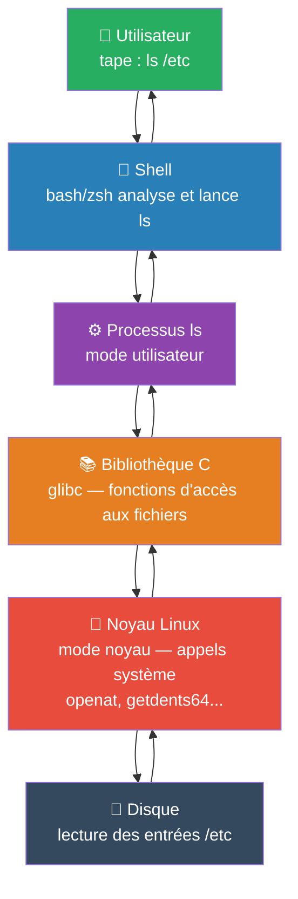
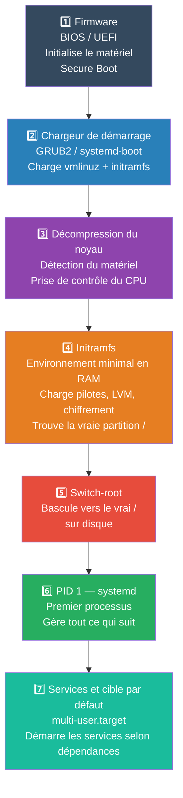
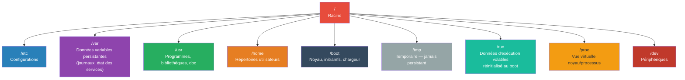

---
tags:
  - linux
  - fondamentaux
  - noyau
  - système
  - démarrage
  - fhs
  - systemd
  - sysadmin
  - devops
---

# Notions fondamentales Linux

> **Linux au sens strict** = le noyau seul (Linus Torvalds, 1991, licence GPL)
> **Linux au sens courant** = une distribution complète (noyau + bibliothèques + outils + init + gestionnaire de paquets)

---

## Les composants d'un système Linux

| Composant | Rôle | Exemple |
|---|---|---|
| **Noyau** | Gère matériel, mémoire, processus | Linux 6.x |
| **Bibliothèques** | Interface entre programmes et noyau | glibc, musl |
| **Shell** | Interprète les commandes | bash, zsh, sh |
| **Outils système** | Manipulation fichiers, réseau, processus | coreutils, util-linux |
| **Gestionnaire de paquets** | Installation et mises à jour | apt, dnf, apk |
| **Init / PID 1** | Démarre et supervise les services | systemd |

**Distributions serveur courantes :** Ubuntu Server, Debian, RHEL/Rocky Linux, Alpine Linux

---

## Architecture — Comment une commande voyage jusqu'au noyau



> **Règle fondamentale** : le shell n'est pas Linux. C'est un programme utilisateur ordinaire. Linux = le noyau qui arbitre l'accès aux ressources.

### Mode noyau vs mode utilisateur

| Mode | Accès | Risque |
|---|---|---|
| **Mode noyau** | Accès total au matériel | Un bug peut paralyser le système entier |
| **Mode utilisateur** | Privilèges restreints | Un crash ne touche pas le reste du système |

La frontière est franchie uniquement par les **appels système** — c'est le mécanisme de sécurité central.

### À ne pas confondre

| ❌ | ✅ |
|---|---|
| Linux = une distribution | Linux = le noyau ; Debian/Ubuntu/RHEL = des distributions |
| Shell = terminal | Terminal affiche, shell interprète |
| /proc et /sys = répertoires de données | /proc et /sys = vues virtuelles sur le noyau |
| /tmp = stockage durable | /tmp = temporaire, jamais de persistance garantie |

---

## Le processus de démarrage (7 étapes)



### Noyau installé ≠ noyau en cours d'exécution

```bash
ls /boot/vmlinuz*       # noyaux installés
readlink /boot/vmlinuz  # noyau par défaut
uname -r                # noyau actuellement en cours d'exécution
grep -o 'BOOT_IMAGE=[^ ]*' /proc/cmdline  # noyau réellement démarré
```

> ⚠️ Une mise à jour de sécurité du noyau **n'a aucun effet** tant que la machine n'a pas redémarré. Les outils de conformité distinguent "corrigé" de "redémarré".

### Points de blocage fréquents au démarrage

| Étape | Cause fréquente |
|---|---|
| **Initramfs** | Pilote manquant, volume LVM/chiffré non trouvé |
| **systemd** | Service en échec, dépendance non résolue |

---

## Hiérarchie du système de fichiers (FHS)



### 3 réflexes d'administration

| Besoin | Répertoire |
|---|---|
| Chercher une configuration | `/etc/` |
| Analyser un problème | `/var/log/` |
| Repérer un fichier runtime (socket, PID) | `/run/` |
