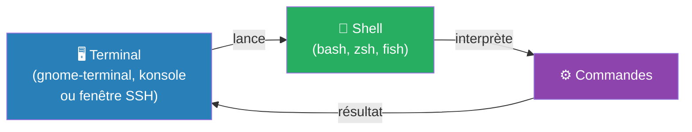

---
tags:
  - linux
  - terminal
  - shell
  - prompt
  - bash
  - nano
  - vim
  - fondamentaux
  - sysadmin
---

# Le terminal et le prompt

> Le terminal est votre porte d'entrée vers Linux. Toute l'administration passe par là : installer un paquet, lire un log, démarrer un service.

---

## Terminal, shell, session — trois mots à distinguer

| Mot | Ce que c'est |
|---|---|
| **Terminal** | L'application (fenêtre graphique ou connexion SSH) qui affiche du texte |
| **Shell** | Le programme qui interprète vos commandes (Bash, Zsh, Fish…) |
| **Session** | La connexion active d'un utilisateur, du login au logout |



> `$SHELL` = shell **déclaré** pour votre compte (pas forcément celui qui tourne)
> `ps -p $$ -o comm=` = shell **réellement actif** → c'est la réponse fiable

```bash
echo "$SHELL"          # shell déclaré dans /etc/passwd
ps -p $$ -o comm=      # shell réellement en cours d'exécution
getent passwd "$(id -u)" | cut -d: -f7   # idem via la base utilisateurs
```

---

## Lire le prompt

```
student@serveur:~$
│       │        │ │
│       │        │ └─ $ = utilisateur normal  /  # = root
│       │        └─── ~ = répertoire courant (~ = /home/student)
│       └──────────── nom de la machine (hostname)
└──────────────────── nom de l'utilisateur connecté
```

> ⚠️ **Si le prompt se termine par `#` → vous êtes root**. Une erreur peut casser le système. Restez en utilisateur normal sauf besoin explicite.

### La variable PS1 — la recette derrière l'affichage

```bash
echo "$PS1"    # affiche la recette de l'invite
```

| Séquence | Affichage |
|---|---|
| `\u` | Nom de l'utilisateur |
| `\h` | Nom de la machine |
| `\w` | Répertoire courant — chemin complet (`~` pour le home) |
| `\W` | Répertoire courant — **dernier élément seulement** |
| `\$` | `#` si root (uid=0), `$` sinon |
| `\s` `\v` | Nom et version du shell |

> ⚠️ Définir PS1 entre guillemets **doubles** (`"\w"`) fait interpréter `\w` immédiatement. Utiliser des guillemets **simples** pour que la valeur soit recalculée à chaque prompt.

---

## Premières commandes

```bash
whoami              # qui suis-je ?
pwd                 # où suis-je ?
hostname            # sur quelle machine ?
date                # quelle date/heure ?
cat /etc/os-release # quelle distribution ?
uname -r            # quelle version du noyau ?
```

> **La casse compte** : `whoami` fonctionne, `Whoami` donne `command not found`.

---

## Comprendre les premières erreurs

| Ce que vous tapez | Message | Cause |
|---|---|---|
| `Whoami` | `command not found` | Casse incorrecte |
| `ls /dossier-inexistant` | `No such file or directory` | Le chemin n'existe pas |
| `cat /root/secret` | `Permission denied` | Droits insuffisants |
| `cd /etc/passwd` | `Not a directory` | C'est un fichier, pas un dossier |

> **Réflexe** : lire le message d'erreur avant de retaper — il dit presque toujours ce qui ne va pas.

---

## Raccourcis clavier essentiels

| Raccourci | Effet | Géré par |
|---|---|---|
| **Tab** | Complétion automatique | Shell |
| **Tab Tab** | Lister les candidats | Shell |
| **↑ / ↓** | Naviguer dans l'historique | Shell |
| **Ctrl+R** | Rechercher dans l'historique | Shell |
| **Ctrl+A** | Aller au début de la ligne | Shell (bash) |
| **Ctrl+E** | Aller à la fin de la ligne | Shell (bash) |
| **Ctrl+U** | Effacer du curseur jusqu'au début | Terminal + shell |
| **Ctrl+W** | Effacer le mot avant le curseur | Terminal + shell |
| **Ctrl+L** | Effacer l'écran | Shell |
| **Ctrl+C** | Interrompre la commande en cours (envoie SIGINT) | Terminal |
| **Ctrl+D** | Fin de saisie — ferme le shell si ligne vide | Terminal |
| **Ctrl+Shift+C** | Copier dans le terminal | Terminal |
| **Ctrl+Shift+V** | Coller dans le terminal | Terminal |

> **Ctrl+C ≠ Ctrl+D** :
> - `Ctrl+C` interrompt le programme (signal SIGINT, code retour 130)
> - `Ctrl+D` signale "fin de saisie" — ne génère aucun signal
> - Si `IGNOREEOF` est défini, `Ctrl+D` ne ferme pas le shell → utiliser `exit`

### Historique des commandes

```bash
history              # liste numérotée des commandes
!2                   # rejoue la commande n°2 (réaffiche avant d'exécuter)
!ls                  # rejoue la dernière commande commençant par "ls"
# Ctrl+R puis taper quelques lettres → recherche dans l'historique
```

---

## Éditeurs de texte en ligne de commande

### nano — celui qui affiche ses commandes

```bash
nano /chemin/fichier.txt
```

| Raccourci | Action |
|---|---|
| **Ctrl+O** | Écrire (sauvegarder) |
| **Ctrl+X** | Quitter |
| **Ctrl+W** | Rechercher |
| **Ctrl+K** | Couper une ligne |
| **Ctrl+U** | Coller |

Séquence de base : écrire → `Ctrl+O` → `Entrée` → `Ctrl+X`

### vi/vim — celui dont on n'arrive pas à sortir

```bash
vi /chemin/fichier.txt
```

vi démarre en **mode normal** — les touches sont des commandes, pas du texte.

| Vous voulez | Tapez | Note |
|---|---|---|
| Écrire du texte | `i` | Passe en mode insertion (`-- INSERTION --` s'affiche) |
| Revenir aux commandes | **Échap** | À faire avant toute commande `:` |
| Enregistrer et quitter | `:wq` + Entrée | write + quit |
| Quitter **sans** enregistrer | `:q!` + Entrée | Force l'abandon |

> **Coincé dans vim ?** → `Échap` puis `:q!` puis `Entrée`

### Variable EDITOR

Certaines commandes (`crontab -e`, `visudo`, `systemctl edit`) ouvrent un éditeur automatiquement selon `$EDITOR` :

```bash
echo "$EDITOR"        # vide = tombe sur vi par défaut
export EDITOR=nano    # forcer nano pour la session
```

---

## Dépannage

| Symptôme | Cause probable | Solution |
|---|---|---|
| Invite affiche `#` | Vous êtes root | `id -u` → si `0`, sortir avec `exit` |
| Invite réduite à `bash-5.2$` | Shell sans configuration (`--norc`) | Vérifier `~/.bashrc` |
| `$SHELL` ≠ shell utilisé | `$SHELL` = shell déclaré, pas actif | `ps -p $$ -o comm=` |
| Tab ne complète rien | Aucun candidat ou complétion non installée | `compgen -c <début>` |
| Affichage sans couleur / caractères parasites | `TERM` absent ou incorrect | `echo "$TERM"` puis `tput colors` |
| `Ctrl+D` ne ferme pas le shell | `IGNOREEOF` définie | Utiliser `exit` |
| `nano : commande introuvable` | Non installé (image minimale) | Utiliser `vi` |
| Impossible de sortir de `vi` | Mode insertion actif | `Échap` puis `:q!` puis `Entrée` |
| Texte dans `vi` déclenche des actions | Mode normal, pas insertion | `Échap` puis `i` pour insérer |
