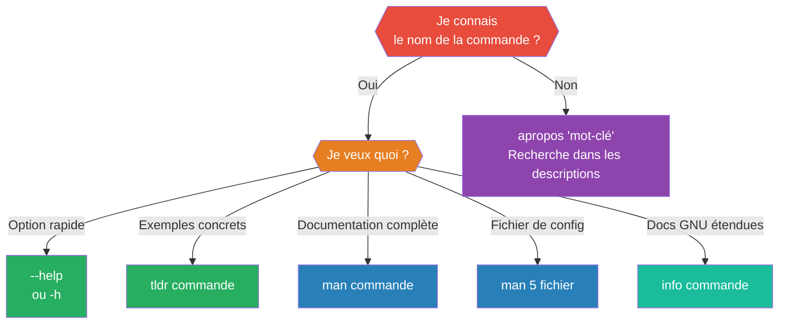

---
tags:
  - linux
  - aide
  - man
  - documentation
  - terminal
  - fondamentaux
  - sysadmin
---

# Obtenir de l'aide sous Linux

> La vraie compétence d'un administrateur système n'est pas de tout connaître par cœur, mais de savoir trouver l'information en quelques secondes sans quitter le terminal.

---

## Choisir le bon outil



| Situation | Outil | Exemple |
|---|---|---|
| Je connais la commande, je cherche une option | `--help` | `tar --help` |
| Je veux des exemples pratiques rapidement | `tldr` | `tldr tar` |
| Je veux la documentation complète | `man` | `man cp` |
| Je cherche un fichier de configuration | `man 5` | `man 5 fstab` |
| Je ne connais pas la commande | `apropos` | `apropos "copy files"` |
| Vérifier en un mot ce que fait une commande | `whatis` | `whatis ls cp` |
| Documentation étendue GNU | `info` | `info grep` |

---

## Installer les outils d'aide

```bash
# Vérifier ce qui est présent
command -v man apropos whatis info

# Debian / Ubuntu
sudo apt install man-db manpages info
sudo mandb   # construit l'index pour apropos et whatis

# Rocky / RHEL / Fedora
sudo dnf install man-db man-pages info
sudo mandb

# tldr (via pipx)
sudo apt install pipx       # ou dnf install epel-release && dnf install pipx
pipx install tldr
tldr --update
```

> ⚠️ Sur une installation minimale, `man`, `apropos` et `whatis` peuvent être absents. `sudo mandb` est indispensable — sans cet index, `apropos` retourne toujours `nothing appropriate`.

---

## `--help` — aide rapide

```bash
ls --help
cp --help
mkdir --help
ls --help | less   # paginer si trop long
```

> Utiliser `--help` quand vous connaissez déjà la commande et cherchez juste le nom d'une option.
> Si `--help` ne fonctionne pas, essayer `-h`.

---

## `man` — documentation complète

```bash
man ls
man cp
man 5 passwd    # section 5 = formats de fichiers (/etc/passwd)
man 1 passwd    # section 1 = commande utilisateur
```

### Navigation dans man (pager `less`)

| Touche | Action |
|---|---|
| `Espace` | Avancer d'une page |
| `b` | Reculer d'une page |
| `/mot` | Chercher dans la page |
| `n` | Résultat suivant |
| `N` | Résultat précédent |
| `q` | Quitter |

> 💡 Taper `/EXAMPLES` puis `Entrée` pour sauter directement aux exemples.

### Structure d'une page man

| Section | Contenu | Ce qu'on y cherche |
|---|---|---|
| **NAME** | Nom et description courte | Vérifier que c'est la bonne commande |
| **SYNOPSIS** | Syntaxe d'utilisation | Options et arguments attendus |
| **DESCRIPTION** | Explication détaillée | Comprendre ce que fait la commande |
| **OPTIONS** | Liste complète des options | Trouver l'option dont on a besoin |
| **EXAMPLES** | Exemples d'utilisation | Copier et adapter |
| **FILES** | Fichiers de configuration liés | Trouver où modifier le comportement |
| **SEE ALSO** | Commandes et pages liées | Découvrir des commandes complémentaires |
| **EXIT STATUS** | Codes de retour | Comprendre les erreurs dans un script |

### Sections du manuel

| Section | Contenu |
|---|---|
| 1 | Commandes utilisateur |
| 5 | Formats de fichiers et conventions |
| 8 | Commandes d'administration système |

---

## `apropos` — trouver une commande par mot-clé

```bash
apropos "copy files"
apropos partition
apropos "network interface"
apropos -a file space usage   # plusieurs mots-clés
```

Exemple de sortie :
```
cp (1)    - copy files and directories
scp (1)   - OpenSSH secure file copy
rsync (1) - a fast, versatile, remote (and local) file-copying tool
```

> ⚠️ **Chercher le vocabulaire des pages, pas le vôtre.** `apropos "disk usage"` ne trouve ni `df` ni `du` — leurs pages disent *"file system space usage"*, pas *"disk usage"*. Si un essai ne donne rien, reformuler avec un synonyme plus proche du jargon.

---

## `whatis` — description en une ligne

```bash
whatis ls cp mkdir rm
```

Sortie :
```
ls (1)    - list directory contents
cp (1)    - copy files and directories
mkdir (1) - make directories
rm (1)    - remove files or directories
```

---

## `tldr` — exemples pratiques communautaires

```bash
tldr tar
tldr rsync
tldr --update   # mettre à jour les fiches
```

Sortie de `tldr tar` :
```
- Créer une archive compressée :
  tar czf target.tar.gz file1 file2

- Extraire une archive :
  tar xzf source.tar.gz
```

> Utiliser `tldr` pour trouver rapidement **comment** faire quelque chose.
> Utiliser `man` pour comprendre **pourquoi** une option existe.

---

## `info` — documentation étendue GNU

```bash
info coreutils
info grep
```

Navigation : `Entrée` suit un lien, `u` remonte, `q` quitte. En pratique, `man` suffit dans 95 % des cas.

---

## Documentation hors-ligne

```bash
ls /usr/share/doc/openssh-server/
```

Les paquets installés déposent parfois des README, CHANGELOG et exemples de configuration dans `/usr/share/doc/`.

---

## Dépannage

| Symptôme | Cause | Solution |
|---|---|---|
| `No manual entry for xxx` | Page man non installée | Installer `man-db` et le paquet de la commande |
| `apropos: command not found` | `man-db` non installé | `sudo apt install man-db` ou `sudo dnf install man-db` |
| `apropos` retourne `nothing appropriate` | Index non construit | `sudo mandb` ; reformuler avec le vocabulaire des pages |
| `apropos` répond mais pas la commande attendue | Mot-clé dans d'autres pages | `whatis <commande>` pour lire sa description réelle |
| `tldr: command not found` | Non installé | `pipx install tldr` |
| `tldr` ne retourne rien | Base locale absente | `tldr --update` |
| `tldr --update` échoue avec erreur signature | Client Haskell buggé (dépôts Debian/RHEL) | `sudo apt remove tldr` puis `pipx install tldr` |
| Page man en anglais uniquement | Traductions non installées | `sudo apt install manpages-fr` ou `sudo dnf install man-pages-fr` |
| `--help` affiche trop de texte | Sortie longue | `commande --help \| less` |
| `man -w <commande>` ne trouve rien | Page retirée du disque | Réinstaller le paquet correspondant |
