---
tags:
  - linux
  - fhs
  - filesystem
  - arborescence
  - sysadmin
  - fondamentaux
  - devops
---

# Arborescence Linux — À quoi sert chaque répertoire (FHS)

> Le **Filesystem Hierarchy Standard (FHS)** définit où Linux range chaque type de fichier. Pensez-y comme le plan d'un immeuble : chaque étage a une fonction précise.

---

## Réflexe admin — où chercher ?

| Vous cherchez… | Regardez dans… | Commande rapide |
|---|---|---|
| Configuration d'un service | `/etc/` | `ls /etc/<service>/` |
| Journaux d'un service | `/var/log/` ou journalctl | `journalctl -xeu <service>` |
| Un binaire / commande | `/usr/bin/`, `/usr/sbin/` | `which <commande>` |
| État d'exécution (PID, socket) | `/run/` | `ls /run/<service>/` |
| Données persistantes d'un service | `/var/lib/` | `ls /var/lib/<service>/` |
| Fichier temporaire | `/tmp/` ou `/var/tmp/` | `ls /tmp/` |
| Fichiers d'un utilisateur | `/home/<user>/` | `ls -la /home/<user>/` |
| Fichiers de démarrage | `/boot/` | `ls /boot/` |
| Un périphérique (disque, partition) | `/dev/` | `lsblk` |

---

## Vue d'ensemble de l'arborescence

```mermaid
flowchart TD
    R["/\nRacine"] --> ETC["/etc\n⚙️ Configuration"]
    R --> VAR["/var\n📊 Données variables"]
    R --> USR["/usr\n📦 Binaires et bibliothèques"]
    R --> RUN["/run\n⚡ État d'exécution volatile"]
    R --> HOME["/home\n👤 Utilisateurs"]
    R --> BOOT["/boot\n🚀 Démarrage"]
    R --> TMP["/tmp\n🗑️ Temporaire"]
    R --> DEV["/dev\n💾 Périphériques"]
    R --> PROC["/proc\n🔬 Virtuel — processus"]
    R --> SYS["/sys\n🔬 Virtuel — matériel"]
    R --> OPT["/opt\n📥 Applications tierces"]
    R --> SRV["/srv\n🌐 Données servies"]

    VAR --> VLOG["/var/log\nJournaux"]
    VAR --> VLIB["/var/lib\nÉtat persistant services"]
    VAR --> VCACHE["/var/cache\nCaches (nettoyables)"]
    VAR --> VTMP["/var/tmp\nTemp persistant entre reboots"]

    USR --> UBIN["/usr/bin\nCommandes utilisateur"]
    USR --> USBIN["/usr/sbin\nCommandes admin"]
    USR --> ULIB["/usr/lib\nBibliothèques"]
    USR --> ULOCAL["/usr/local\nInstallations manuelles"]

    style R fill:#e74c3c,color:#fff
    style ETC fill:#2980b9,color:#fff
    style VAR fill:#8e44ad,color:#fff
    style USR fill:#27ae60,color:#fff
    style RUN fill:#e67e22,color:#fff
    style PROC fill:#95a5a6,color:#fff
    style SYS fill:#95a5a6,color:#fff
```



---

## Zone par zone

### `/etc/` — Configuration du système

Chaque service installé y dépose sa configuration en **fichiers texte éditables**.

| Chemin | Contenu |
|---|---|
| `/etc/ssh/` | Config SSH (sshd_config, clés host) |
| `/etc/systemd/` | Surcharges locales des unités systemd |
| `/etc/apt/` ou `/etc/yum.repos.d/` | Sources de paquets |
| `/etc/netplan/` ou `/etc/NetworkManager/` | Config réseau persistante |
| `/etc/fstab` | Table des montages persistants |
| `/etc/passwd`, `/etc/shadow`, `/etc/group` | Comptes utilisateurs et groupes |
| `/etc/sudoers`, `/etc/sudoers.d/` | Règles sudo |
| `/etc/crontab`, `/etc/cron.d/` | Tâches planifiées système |

> 🔑 **Règle d'or** : ne jamais modifier un fichier dans `/usr/lib/systemd/` ou `/usr/share/`. Copier/surcharger dans `/etc/` — la surcharge survit aux mises à jour.

```bash
# Exemple de surcharge systemd
ls /usr/lib/systemd/system/containerd.service   # fourni par le paquet
ls /etc/systemd/system/containerd.service.d/    # surcharge locale → intouchée par les MAJ
```

---

### `/var/` — Données variables

Tout ce qui **change** au fil du temps : journaux, caches, bases de données de services.

| Chemin | Contenu | Point d'attention |
|---|---|---|
| `/var/log/` | Journaux système et applicatifs | Premier endroit à consulter lors d'un incident |
| `/var/lib/` | État persistant des services | Ne pas supprimer sans comprendre |
| `/var/cache/` | Caches des gestionnaires de paquets | Nettoyable pour récupérer de l'espace |
| `/var/spool/` | Files d'attente (impression, mail, cron) | Rarement modifié manuellement |
| `/var/tmp/` | Fichiers temporaires persistants entre reboots | Plus durable que `/tmp/` |

```bash
du -sh /var/log/              # espace occupé par les journaux
df -h /var                    # espace restant sur la partition
journalctl -n 50 --no-pager   # dernières entrées du journal
journalctl --vacuum-size=500M # nettoyer les vieux journaux
```

> ⚠️ `/var` peut remplir un disque et bloquer le système entier si partagé avec `/`. En production → partition séparée.

**Journaux selon la distribution :**

| Fichier | Debian/Ubuntu | RHEL/Rocky |
|---|---|---|
| Messages système | `/var/log/syslog` | `/var/log/messages` |
| Authentification | `/var/log/auth.log` | `/var/log/secure` |
| Paquets | `/var/log/dpkg.log` | `/var/log/dnf.log` |

---

### `/usr/` — Binaires, bibliothèques, documentation

Cœur applicatif — tout ce qu'installe le gestionnaire de paquets.

| Chemin | Contenu |
|---|---|
| `/usr/bin/` | Commandes utilisateur (ls, grep, vim…) |
| `/usr/sbin/` | Commandes admin (fdisk, useradd, iptables…) |
| `/usr/lib/` | Bibliothèques partagées (.so) |
| `/usr/lib/systemd/` | Unités systemd des paquets — **ne pas modifier** |
| `/usr/share/` | Documentation, données indépendantes de l'archi |
| `/usr/local/` | Logiciels installés manuellement hors gestionnaire de paquets |

```bash
which systemctl          # trouver un binaire
type -a ls               # voir toutes les occurrences dans le PATH
ldd /usr/bin/ls          # bibliothèques utilisées par un programme
```

---

### Le usr-merge — `/bin`, `/sbin`, `/lib` ne sont plus des répertoires

Sur les distributions modernes (Debian 12+, Ubuntu 22.04+, RHEL 9+, Fedora, Arch), ces chemins sont devenus des **liens symboliques** :

```bash
ls -ld /bin /sbin /lib /lib64 /var/run /var/lock
# → lrwxrwxrwx ... /bin -> usr/bin
# → lrwxrwxrwx ... /sbin -> usr/sbin
# → lrwxrwxrwx ... /lib -> usr/lib
# → lrwxrwxrwx ... /var/run -> /run
```

> ⚠️ Alpine Linux garde la séparation — pas de usr-merge.
> ⚠️ Une documentation qui parle de `/var/run/service.pid` fonctionne encore (lien symbolique), mais l'emplacement correct aujourd'hui est `/run/`.
> ⚠️ `bin` vs `sbin` reste vivant : une commande introuvable en utilisateur ordinaire est souvent dans `sbin`, hors de votre PATH.

---

### `/opt/` et `/usr/local/` — Installer hors gestionnaire de paquets

| Répertoire | Usage | Exemple |
|---|---|---|
| `/opt/<éditeur>/` | Application tierce auto-contenue | `/opt/google/chrome/`, `/opt/jetbrains/` |
| `/usr/local/bin/` | Binaire isolé compilé ou téléchargé | Script maison, outil Go/Rust compilé |

**Pattern courant** — binaire dans `/opt`, lien dans `/usr/local/bin` :

```bash
ls -l /opt/opentofu/tofu
ls -l /usr/local/bin/tofu
# → /usr/local/bin/tofu -> /opt/opentofu/tofu
```

> `/usr/local/bin` est **avant** `/usr/bin` dans le PATH — votre version maison l'emporte sur celle du paquet. Utile et source de confusion lors du dépannage.

---

### `/run/`, `/proc/`, `/sys/` — Données volatiles et virtuelles

Ces répertoires ne sont **pas sur disque** — contenu généré dynamiquement par le noyau.

| Répertoire | Type | Contenu |
|---|---|---|
| `/run/` | tmpfs (RAM) | PID files, sockets, verrous — repart vide au boot |
| `/proc/` | procfs | Vue virtuelle sur les processus et le noyau |
| `/sys/` | sysfs | Vue virtuelle sur le matériel et les pilotes |

```bash
cat /proc/uptime          # uptime en secondes
cat /proc/meminfo | grep MemTotal
cat /proc/cpuinfo | head -20
cat /sys/block/sda/queue/scheduler 2>/dev/null

findmnt -t proc,sysfs,tmpfs -o TARGET,SOURCE,FSTYPE,SIZE
# → /proc et /sys : taille 0 → aucun espace disque consommé
```

> 🚫 **Ne jamais inclure `/proc` et `/sys` dans une sauvegarde** (`tar`, `rsync`) — aucune donnée utile + erreurs ou boucles infinies.

---

### `/tmp/` vs `/var/tmp/` — Durée de vie des fichiers temporaires

```bash
ls -ld /tmp /var/tmp
# drwxrwxrwt ... /tmp   (bit collant : t)
# drwxrwxrwt ... /var/tmp

df -Th /tmp    # vérifier si c'est bien un tmpfs
```

| | `/tmp/` | `/var/tmp/` |
|---|---|---|
| Durée de vie | Jusqu'au prochain reboot | Persistant entre reboots |
| Nettoyage | Par systemd-tmpfiles au démarrage | Périodique (30 jours par défaut) |

> ⚠️ **Idée reçue** : `/tmp` n'est pas forcément en RAM (tmpfs). Sur Ubuntu 24.04 par exemple, c'est la partition ext4 racine. C'est **systemd-tmpfiles** qui le vide au boot, pas le fait d'être en RAM.

```bash
grep -Ev '^#|^$' /usr/lib/tmpfiles.d/tmp.conf
# → D /tmp 1777 root root 30d
# La règle D (delete + create) avec --boot vide /tmp au démarrage
```

> 💡 Dans un script, utiliser `mktemp` plutôt qu'un nom fixe dans `/tmp/` — évite les collisions et les attaques par lien symbolique.

---

### `/dev/` — Périphériques

| Périphérique | Représente |
|---|---|
| `/dev/sda`, `/dev/sdb` | Disques SATA/SAS |
| `/dev/nvme0n1` | Disque NVMe |
| `/dev/vda` | Disque virtio (VM KVM) |
| `/dev/null` | Puits sans fond — rediriger ce qu'on veut ignorer |
| `/dev/zero` | Source infinie de zéros |
| `/dev/random`, `/dev/urandom` | Générateurs de nombres aléatoires |
| `/dev/tty*`, `/dev/pts/*` | Terminaux |

```bash
lsblk
ls -l /dev/sd* /dev/nvme* /dev/vd* 2>/dev/null
```

---

### `/boot/` — Fichiers de démarrage

| Fichier | Rôle |
|---|---|
| `vmlinuz-*` | Noyau Linux compressé |
| `initrd.img-*` / `initramfs-*` | Image système initial (pilotes, LVM, chiffrement) |
| `grub/` | Configuration GRUB2 |
| `config-*` | Options de compilation du noyau |

```bash
ls -lh /boot/vmlinuz-*    # noyaux installés
df -h /boot               # espace disponible
```

> ⚠️ Si `/boot` est plein → purger les anciens noyaux via le gestionnaire de paquets (`apt autoremove` ou `dnf remove --oldinstallonly`), **jamais avec `rm`**.

---

## Différences entre distributions

| Aspect | Debian/Ubuntu | RHEL/Rocky/Fedora | Alpine |
|---|---|---|---|
| Journal système | `/var/log/syslog` | `/var/log/messages` | `/var/log/messages` |
| Logs auth | `/var/log/auth.log` | `/var/log/secure` | `/var/log/messages` |
| Config réseau | `/etc/netplan/` | `/etc/NetworkManager/` | `/etc/network/` |
| Config paquets | `/etc/apt/` | `/etc/yum.repos.d/` | `/etc/apk/` |
| Init (PID 1) | systemd | systemd | OpenRC |
| usr-merge | Oui (Debian 12+) | Oui (RHEL 9+) | **Non** |

---

## Dépannage

| Symptôme | Cause probable | Solution |
|---|---|---|
| `No space left on device` sur `/var` | Journaux ou caches volumineux | `du -sh /var/log/* \| sort -rh` puis `journalctl --vacuum-size=500M` ou `apt clean` |
| Config modifiée mais pas prise en compte | Édité dans `/usr/lib/systemd/` | Créer une surcharge dans `/etc/systemd/system/` + `systemctl daemon-reload` |
| Commande introuvable après install manuelle | Binaire hors du PATH | Déplacer vers `/usr/local/bin/` ou ajouter au PATH |
| `/boot` plein, MAJ noyau impossible | Anciens noyaux non purgés | `apt autoremove` (Debian) ou `dnf remove --oldinstallonly` (RHEL) |
| Fichier temporaire disparu après reboot | Placé dans `/tmp/` | Utiliser `/var/tmp/` pour les fichiers persistants |
| Doc parle de `/bin` vs `/usr/bin` — aucune différence | usr-merge | `ls -ld /bin /sbin /lib` |
| Commande admin introuvable en utilisateur normal | Dans `sbin`, hors du PATH | `echo "$PATH"` |
| Commande installée manuellement ignorée | Ordre du PATH | `type -a <commande>` |
| Sauvegarde de `/` échoue ou ne finit pas | `/proc` et `/sys` inclus | Exclure avec `--exclude=/proc --exclude=/sys` |
