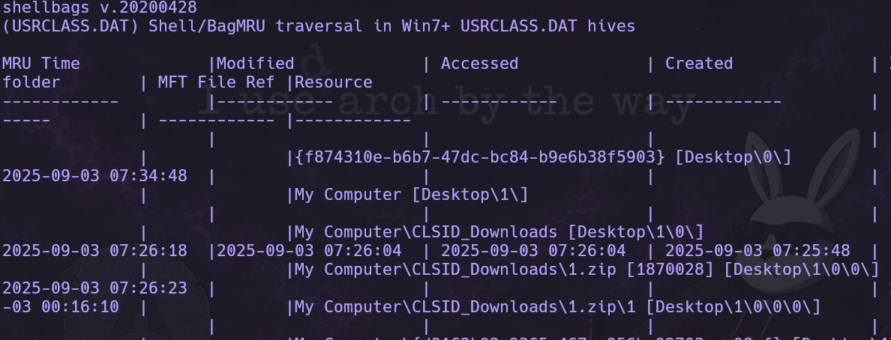
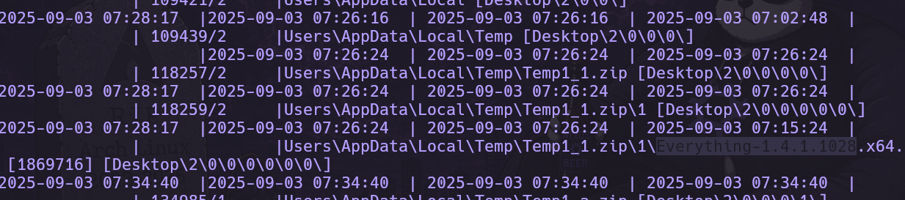
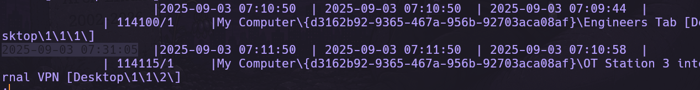
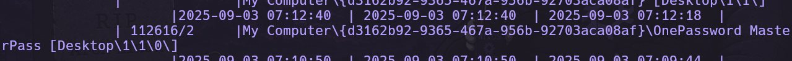
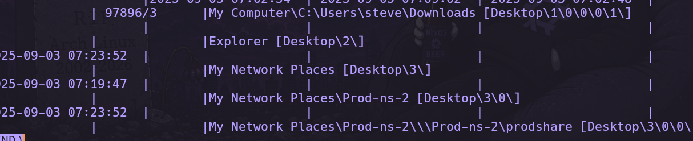
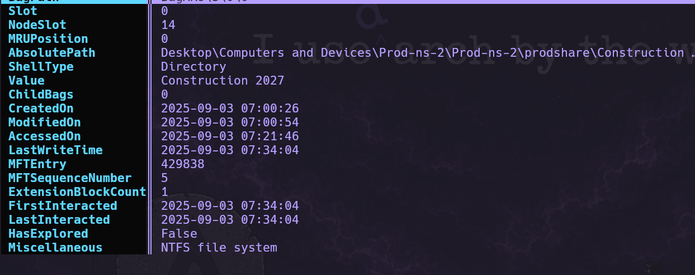
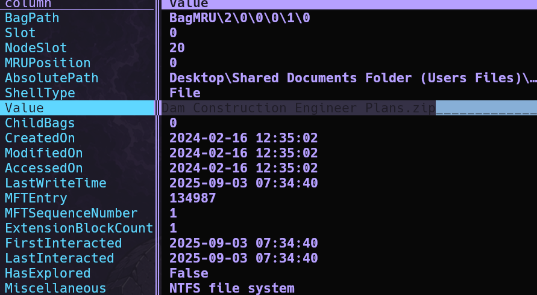
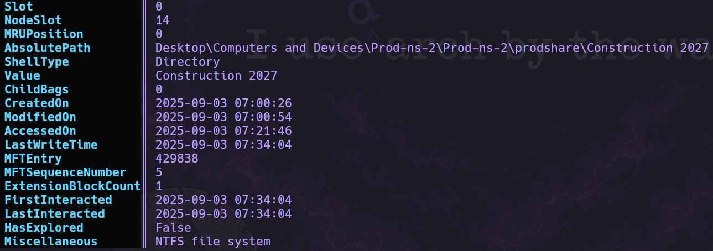
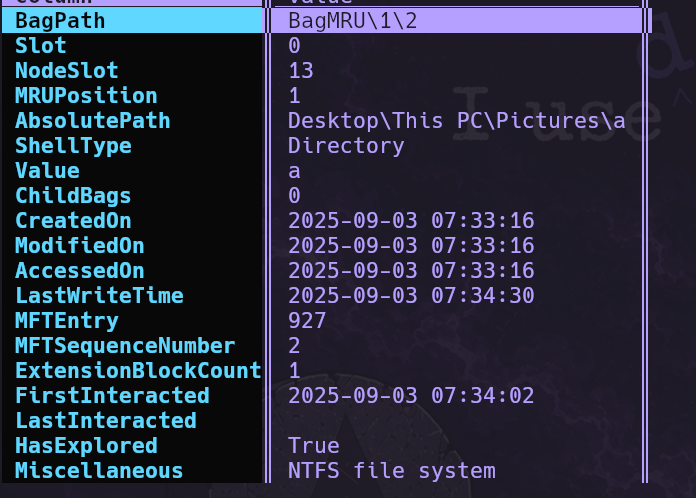
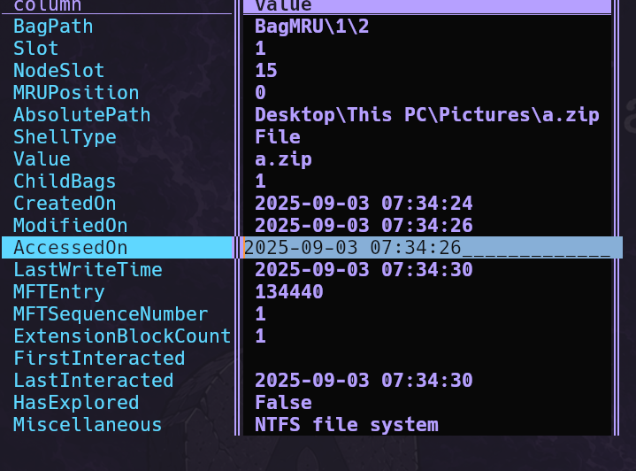

---
tags:
  - writeup/htb
  - ctf
  - forensics
  - digital-forensics
  - windows
  - shellbags
  - log-analysis
---

# Bagages

Sherlock Scenario

This Sherlock provides players with an opportunity to analyze Shellbag artifacts. Shellbags can be used to find evidence of folder access by a specific user, access to network shares, and navigation of archive file contents. This information can be leveraged during investigations to identify potential data access, data staging, and data exfiltration attempts.

[Windows Forensic - Partie 8 : Explorer les Shellbags](https://www.it-connect.fr/windows-forensic-partie-8-explorer-les-shellbags/)

### 1) What was the name of the archive file downloaded by the compromised account?


#### command
```bash

```
╰─○ regripper -r UsrClass.dat -p shellbags > ~/Téléchargements/shellbags.txt 
╰─○ less shellbags_steve.txt
``` 
```

answer 1.zip

### 2) What was the name of the utility brought in by the attacker to search for sensitive data?


answer: Everything-1.4.1.1028

### 3) The attacker navigated the filesystem and found sensitive files used by the victim in their day-to-day work. When was the VPN folder accessed by the attacker?

MRU = Most Recently Used

C'est un mécanisme général de Windows qui garde en mémoire (dans le registre) les derniers éléments utilisés/accédés, pour par exemple réafficher l'historique dans un menu ou reconstruire l'état d'une fenêtre.

Dans le cas des shellbags, la structure s'appelle BagMRU. C'est une clé de registre (dans UsrClass.dat) organisée en arbre : chaque sous-clé correspond à un dossier parcouru dans l'Explorateur Windows, et le nom de la sous-clé est juste un index numérique (0, 1, 2...) qui reflète l'ordre/chemin de navigation — pas le nom du dossier lui-même (celui-ci est stocké dans la valeur binaire du shell item).

answer: 2025-09-03 07:31:05


### 4) What was the name of the directory containing the victim's passwords?

answer: OnePassword MasterPass

### 5) The attacker also accessed a network share to pillage network data. What is the UNC path?

#### command

```bash
─○ regripper -r ~/Téléchargements/Baggage/C/Users/admin/AppData/Local/Microsoft/Windows/UsrClass.dat -p shellbags > ~/Téléchargements/shellbags_admin.txt
╰─○ less shellbags_admin.txt
```



answer: \\Prod-ns-2\prodshare


### 6) When was the archive file from the network share accessed?


```bash
╰─○ sbecmd -d Baggage/C/Users --csv shellbags --nl                   
SBECmd version 2026.5.0

Author: Eric Zimmerman (saericzimmerman@gmail.com)
https://github.com/EricZimmerman

Command line: -d Baggage/C/Users --csv shellbags --nl

Directory to process: /home/tximi/Téléchargements/Baggage/C/Users
Deduplication: False
All messages will be saved to /home/tximi/Téléchargements/shellbags/!SBECmd_Messages.txt
Processing /home/tximi/Téléchargements/Baggage/C/Users/admin/NTUSER.DAT
Registry hive is dirty and no transaction logs were found in the same directory. Data may be missing! Continuing anyways...
Sequence numbers do not match! Hive is dirty and the transaction logs should be reviewed for relevant data!
Parse time: 0.26 seconds

Total ShellBags found: 3


╰─○ vd 0_UsrClass.csv 
saul.pw/VisiData v3.3
opening 0_UsrClass.csv as csv

```


answer: 2027

### 7) What was the name of the archive file present on the network share?




answer: Dam Construction Engineer Plans.zip

### 8) When was the archive file from the network share accessed?



answer: 2025-09-03 07:34:04

### 9) The attacker created a staging folder to prepare for collection and exfiltration. What is the full path of the staging folder?





answer: C:\users\Steve\Pictures\a 


### 10) The attacker compressed the staging folder to prepare the data for exfiltration. When was the exfiltration archive file accessed?


