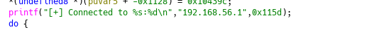
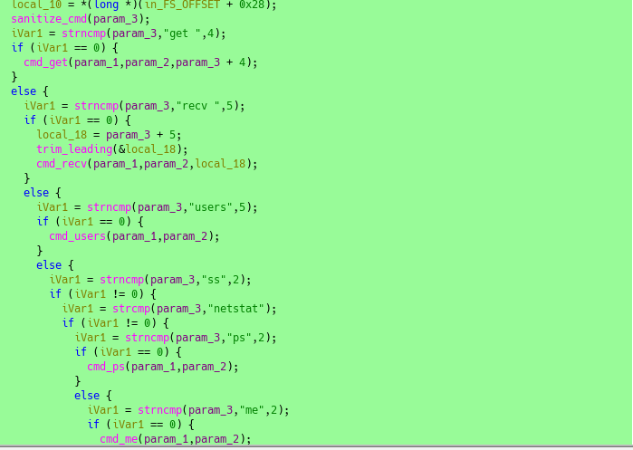
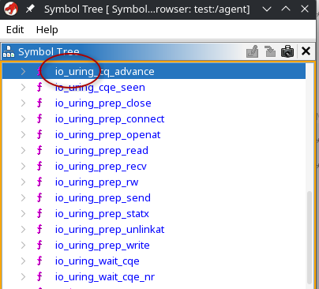
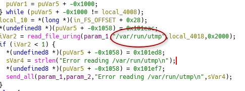
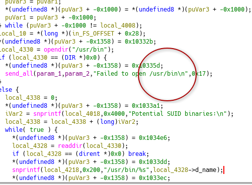
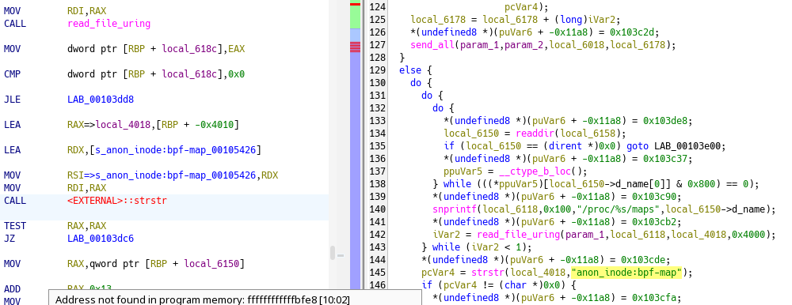
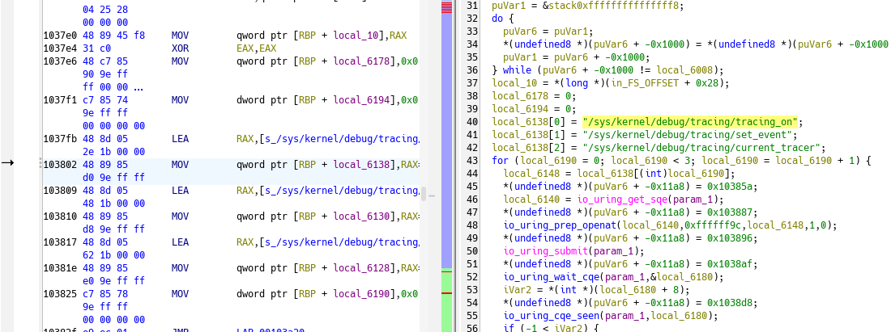
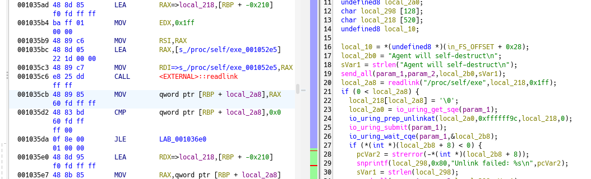
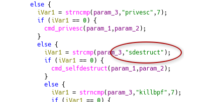

---
tags:
  - writeup/htb
  - ctf
  - malware-analysis
  - reverse-engineering
  - linux
  - io-uring
  - ebpf
---

## Sherlock Scenario 

Your organization's SOC team intercepted a suspicious binary during a routine threat hunting operation on a Linux server. The file was found in /var/tmp with an unusual name and was attempting to establish outbound connections. Initial analysis suggests this could be a post-exploitation agent. Your task is to perform static analysis on the binary to identify its capabilities, extract indicators of compromise, and understand the threat actor's infrastructure.

### 1What is the SHA256 hash of the malicious binary?


```bash
╰─○ sha256sum agent
2d7b1b2178f76c26893b2a56cbf9b36700235259e76b893d53817d5b66b634a5  agent
```


### 2 What is the IP address hardcoded in the binary for C2 communication?

Un simple strings permet de solve

```bash
─○ file agent 
zsh: correct 'file' to 'idle' [nyae]? n
agent: ELF 64-bit LSB pie executable, x86-64, version 1 (SYSV), dynamically linked, interpreter /lib64/ld-linux-x86-64.so.


─○ strings agent
*] Tracing disabled: %s
/sys/fs/bpf
/sys/fs/bpf/%s
[+] Deleted BPF file: %s
[-] Failed to open /proc: %s
/proc/%s/maps
anon_inode:bpf-map
[+] Killed PID using BPF: %d
[-] Failed to kill PID %d: %s
[*] No processes with BPF map found
get 
recv 
users
netstat
kick
privesc
sdestruct
killbpf
exit
[*] 404 Command not found [*]
io_uring_queue_init
192.168.56.1
socket
io_uring_wait_cqe: %s
connect() failed: trying to reconnect
[+] Connected to %s:
```

En outre 

### 3What port does the agent connect to on the C2 server?

On note l'appel a htons qui permet de convertir une valeur 16 bits de l'ordre d'octets machine vers l'ordre réseau. (valeur en little indian à la base)

```bash
gef➤  disass main
Dump of assembler code for function main:
SNIP
0x0000000000004200 <+153>:	mov    edi,0x115d
0x0000000000004205 <+158>:	call   0x1350 <htons@plt>
SNIP
End of assembler dump.
gef➤   p/d 0x115d
$1 = 4445
```
Port 4445

### 4 How many seconds does the agent wait before attempting to reconnect after a failed connection?

On note un sleep
```bash
0x00000000000043e7 <+640>:	mov    edi,0x78
0x00000000000043ec <+645>:	call   0x14e0 <sleep@plt>
gef➤  p/d 0x78
$2 = 12
```


### 5 ) How many different commands does the agent support? (excluding invalid commands)


On sort ghidra




### 6) What Linux kernel interface does this malware abuse to evade EDR syscall monitoring?




Qu'est-ce que io_uring ?Une technologie Linux qui gère les lectures et écritures de fichiers ou réseaux en arrière-plan.Utilise des zones de mémoire partagée (anneaux ou ring buffers) entre l'utilisateur et le noyau.Permet d'exécuter des opérations sans passer par les appels système (syscalls) traditionnels de manière classique.

https://www.sysdig.com/blog/detecting-and-mitigating-io-uring-abuse-for-malware-evasion 
https://www.armosec.io/blog/io_uring-rootkit-bypasses-linux-security/

### 7) What file does the agent read to enumerate logged-in users?



### 8) What directory does the agent scan when searching for SUID binaries for privilege escalation?




### 9) What string does the agent search for in /proc/[pid]/maps to identify security tools using eBPF?





https://www.synacktiv.com/publications/linkpro-analyse-dun-rootkit-ebpf

### 10) What is the full path of the first tracing file the agent attempts to disable?

### 11)  What procfs path does the agent read to find its own executable location before self-destruction?



### 12) What command string is compared by the agent to trigger deletion of its own binary?



